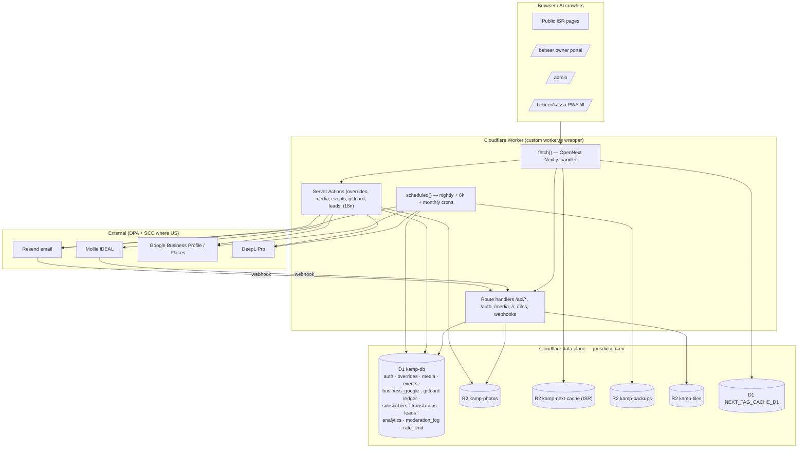

# Backend Master Plan — Ondernemers van de Kamp

> The backend-first execution plan. Read this before any feature UI.
> Stack: Next.js 16 (App Router, React 19) on Cloudflare Workers via `@opennextjs/cloudflare` v1.19. D1 (SQLite, EU jurisdiction) for all relational data, R2 for binaries + ISR cache, magic-link auth with server-side D1 sessions. Wrangler for deploy. Edge runtime — **no Node-only APIs**: Web Crypto, `fetch`, and D1/R2 bindings only.

---

## 0. How this fits the roadmap & how to read it

This document consolidates the backend slices of **all nine roadmap epics** (launch, design-system leads funnel, owner-ops, google-reviews, agenda/events, owner-story, newsletter, cadeaukaart, i18n, discovery, analytics) into one coherent architecture and one dependency-ordered build sequence. The owner's directive is **backend first**: every feature's data model, route handlers, jobs, and tests land and are tested *before* its UI.

**The single hard prerequisite for everything below is the launch epic** (§9 step 1). Today the app has *never been deployed*: `wrangler.jsonc` carries `"database_id": "REPLACE_WITH_D1_DATABASE_ID"`, the tag cache is the dummy no-op, there is no cron, no rate limiting, no CI, no backups. Nothing else can ship until that is fixed.

**Read order:** §1 (where we are) → §2 (where we're going) → §3 (every table) → §9 (the build sequence — this is the actionable checklist) → §4–§8, §10–§11 as reference while building each slice.

**Conventions that are invariant across every epic** (match the existing codebase — do not deviate):
- All ids are `crypto.randomUUID()` (Web Crypto, edge-safe). All timestamps are `INTEGER` epoch-ms.
- Every table is `CREATE TABLE IF NOT EXISTS`. Migrations are additive and forward-only.
- Every D1 read seam follows the `businessData.ts`/`overrides.ts` pattern: a `NEXT_PHASE === 'phase-production-build'` guard returns the static seed/empty at build time so `next build` is hermetic and never touches D1; `getDB() === null` and any thrown error fall back silently to the seed.
- **D1 has no interactive `BEGIN/COMMIT` transactions on Workers.** Every multi-row money/ownership mutation is either a single conditional statement or `db.batch([...])` (exposed in `cf.ts`). Never read-then-write across statements where a race matters.
- Owner isolation is re-checked **server-side inside every Server Action** (`canEdit(user, businessId)` — two args — or `requireAdmin()`), never relying on the page guard alone.

---

## 1. Current backend (from grounding)

**Bindings (`wrangler.jsonc`):** `DB` (D1 `kamp-db`, id is a placeholder), `PHOTOS` (R2 `kamp-photos`), `NEXT_INC_CACHE_R2_BUCKET` (R2 `kamp-next-cache`, ISR), `ASSETS`. `compatibility_date 2025-09-01`, flags `nodejs_compat` + `global_fetch_strictly_public`. `vars.NEXT_PUBLIC_SITE_URL`.

**D1 tables (migrations 0001 + 0002):**
- `profiles` (id, email UNIQUE lowercased, role `owner|admin`, created_at)
- `sessions` (id 64-hex, profile_id FK ON DELETE CASCADE, expires_at 30-day, created_at; `idx_sessions_profile`)
- `auth_tokens` (token 64-hex PK, email, expires_at +15min, used 0/1, created_at)
- `owner_business` (profile_id FK CASCADE, business_id seed-id no FK, created_at; PK composite) — **written only by manual admin INSERT, no UI**
- `business_overrides` (id, business_id, fields JSON, status `pending|approved|rejected`, submitted_by, submitted_at, reviewed_by, reviewed_at, reason; `idx_overrides_business(business_id,status)`)
- `business_media` (id, business_id, kind `hero|gallery`, r2_key, public_url, status `pending|approved|rejected|superseded`, submitted_by/at, reviewed_by/at; `idx_media_business(business_id,status)`)
- `app_settings` (key PK ∈ {resend_api_key, resend_from, admin_emails, site_url}, value, updated_at)

**Auth/sessions:** magic link → `auth_tokens` (single-use, 15-min) → Resend email → `/auth/callback?token=` → `completeLogin` (mark used, `ensureProfile`, INSERT session) → httpOnly/secure/sameSite=lax cookie `kamp_session` (30 days, opaque UUID, **no HMAC** — `AUTH_SECRET` is declared in `KampEnv` but unused). `getCurrentUser()` JOINs sessions+profiles and checks expiry. `requireUser()`/`requireAdmin()` redirect. First login on an empty admin set is auto-promoted to admin.

**Override merge:** `getOverrides()` selects `status='approved'` for all businesses `ORDER BY reviewed_at ASC, submitted_at ASC`, spread-merges per `business_id` so newest field value wins. Build-guarded.

**R2 media:** upload (6 MB Server Action limit) → magic-byte MIME sniff (JPEG/PNG/WebP/AVIF) → 5 MB cap → R2 PUT `business/{id}/{uuid}-{hex4}.{ext}` immutable → INSERT pending + supersede prior pending. Serve `/media/[...key]` (force-dynamic): approved = public immutable; pending = session+`canEdit` gate, private no-store; rejected/superseded = 404.

**Settings:** `app_settings` UPSERT via `saveSettingsAction`; getters fall back env → default.

**GDPR:** `purgeBusiness()` / `purgeProfile()` delete R2 then D1 in order; `profiles` cascades to sessions + owner_business.

**Deploy/ISR/caching:** OpenNext build → `.open-next/worker.js` (**exports only `fetch`**). `r2IncrementalCache` persists ISR. **Tag cache = dummy no-op** → `revalidatePath`/`revalidateTag` do nothing in prod; freshness is time-based only (`export const revalidate = 300`). No cron, no Queues, no rate limiting, no CI/tests.

**Secrets:** `AUTH_SECRET` (reserved/unused), `RESEND_API_KEY`, `ADMIN_EMAILS` — via `wrangler secret put` or `app_settings`.

---

## 2. Target backend architecture

**End-state bindings (`wrangler.jsonc`):**

| Binding | Type | Resource | Purpose |
|---|---|---|---|
| `DB` | D1 | `kamp-db` (**`--jurisdiction eu`**) | All relational data, all features |
| `NEXT_TAG_CACHE_D1` | D1 | `kamp-db` (same DB, second binding) | `d1-next-tag-cache` for instant invalidation |
| `PHOTOS` | R2 | `kamp-photos` (`--jurisdiction eu`) | Owner/event/story photos |
| `NEXT_INC_CACHE_R2_BUCKET` | R2 | `kamp-next-cache` (`--jurisdiction eu`) | ISR incremental cache |
| `BACKUPS` | R2 | `kamp-backups` (`--jurisdiction eu`) | Nightly D1 JSON dumps |
| `TILES` | R2 | `kamp-tiles` (`--jurisdiction eu`) | Self-hosted Protomaps `.pmtiles` (discovery) |
| `ASSETS` | Assets | — | Static assets |

**External services (all under signed DPA; EU-residency posture documented in ROPA):**

| Service | Use | Residency reality | Secret(s) |
|---|---|---|---|
| Resend | Transactional (magic link) + bulk (newsletter) email via HTTP API | **US processor** — `eu-west-1` only controls *send region*; account data/logs are US, lawful via DPF+SCC. **Never call it "EU-resident."** | `RESEND_API_KEY`, `RESEND_WEBHOOK_SECRET` |
| Mollie | iDEAL payments + payouts (gift card) | EU (Amsterdam) | `MOLLIE_API_KEY` |
| Google Business Profile API | Owner-OAuth review read/respond | OAuth tokens stored AES-GCM-encrypted in D1 (EU) | `GOOGLE_CLIENT_ID`, `GOOGLE_CLIENT_SECRET` (in `app_settings`) |
| Google Places API | `place_id` resolution only (the one cache-exempt field) | only `place_id` persisted; **review text never cached** | (shares Google creds) |
| DeepL API Pro | Machine pre-translation (i18n) | EU (Germany), no-retention DPA | `DEEPL_API_KEY` |
| Cloudflare Web Analytics + Turnstile | Cookieless pageviews + bot challenge | EU/global edge | `TURNSTILE_SECRET_KEY`, `NEXT_PUBLIC_TURNSTILE_SITE_KEY` |

**Architecture diagram:**



**Static seed stays source of truth for business identity.** `src/data/businesses.ts` (~67 rows) is permanent; D1 stores only approved deltas + new feature data. New per-business fields (`place_id`, `priceBand`, `dietaryTags`) are added to the seed type as additive optional fields.

---

## 3. Full D1 schema evolution

All new tables ship as **`migrations/0003_*.sql` onward**, one file per feature, applied via `wrangler d1 migrations apply kamp-db --remote`. Ordering is by build sequence (§9). All are additive — no existing table is altered destructively. `business_id` columns reference the seed id with **no FK** (matching existing convention); FKs are used only where both sides live in D1.

### 0003_launch.sql — rate limiting + login throttle (launch)

```sql
-- Atomic login throttle (paired with WAF + Turnstile). Sliding window per key.
CREATE TABLE IF NOT EXISTS login_throttle (
  key         TEXT PRIMARY KEY,          -- 'ip:1.2.3.4' | 'email:foo@bar.nl'
  count       INTEGER NOT NULL DEFAULT 0,
  window_start INTEGER NOT NULL          -- epoch-ms of current window
);

-- Generic in-app sliding-window limiter (PRIMARY control; Free-plan WAF has 1 rule).
CREATE TABLE IF NOT EXISTS rate_limit (
  key         TEXT PRIMARY KEY,          -- '{scope}:{ip|email}'
  count       INTEGER NOT NULL DEFAULT 0,
  window_start INTEGER NOT NULL
);
```

### 0004_owner_ops.sql — leads + invites + moderation audit (owner-ops + design-system leads)

```sql
-- Inbound business-listing applications (replaces the mailto: /aanmelden flow).
CREATE TABLE IF NOT EXISTS leads (
  id            TEXT PRIMARY KEY,
  business_id   TEXT,                    -- optional: claim of an existing seed id
  business_name TEXT NOT NULL,
  contact_name  TEXT NOT NULL,
  email         TEXT NOT NULL,           -- lowercased
  phone         TEXT,
  address       TEXT,
  story         TEXT,
  instagram     TEXT,
  consent_text  TEXT NOT NULL,           -- exact consent copy shown (audit proof)
  consent_at    INTEGER NOT NULL,
  confirm_token TEXT,                    -- double-opt-in, 7-day TTL
  confirmed_at  INTEGER,
  status        TEXT NOT NULL DEFAULT 'new', -- new|confirmed|approved|rejected|converted
  source        TEXT,                    -- 'owner:<id>' | 'qr' | 'web'
  created_at    INTEGER NOT NULL,
  reviewed_by   TEXT,
  reviewed_at   INTEGER
);
CREATE INDEX IF NOT EXISTS idx_leads_status ON leads(status, created_at);
CREATE INDEX IF NOT EXISTS idx_leads_email  ON leads(email);

-- Single-use claim invite that finally gives owner_business a UI writer.
CREATE TABLE IF NOT EXISTS owner_invites (
  token       TEXT PRIMARY KEY,          -- 64-hex
  email       TEXT NOT NULL,             -- ownership binds only on email match
  business_id TEXT NOT NULL,
  expires_at  INTEGER NOT NULL,          -- +14 days
  claimed_at  INTEGER,                   -- set once (idempotent)
  created_by  TEXT NOT NULL,             -- admin profile id
  created_at  INTEGER NOT NULL
);
CREATE INDEX IF NOT EXISTS idx_invites_email ON owner_invites(email);

-- Immutable audit of every moderation decision (approve/reject/invite/purge/claim).
CREATE TABLE IF NOT EXISTS moderation_log (
  id          TEXT PRIMARY KEY,
  actor_id    TEXT NOT NULL,            -- profile id or 'system'
  action      TEXT NOT NULL,           -- 'approve_override'|'reject_media'|'invite'|'purge'|'claim'|...
  target_type TEXT NOT NULL,           -- 'override'|'media'|'business'|'lead'|'event'|...
  target_id   TEXT NOT NULL,
  business_id TEXT,
  detail      TEXT,                    -- JSON
  created_at  INTEGER NOT NULL
);
CREATE INDEX IF NOT EXISTS idx_modlog_target ON moderation_log(target_type, target_id);

-- Freshness/seasonal-hours nudge dedupe + erasure index.
CREATE TABLE IF NOT EXISTS nudge_log (
  business_id TEXT NOT NULL,
  kind        TEXT NOT NULL,           -- 'freshness'|'seasonal_hours'
  window_key  TEXT NOT NULL,           -- e.g. '2026-Q2'
  email       TEXT,
  sent_at     INTEGER NOT NULL,
  PRIMARY KEY (business_id, kind, window_key)
);
CREATE INDEX IF NOT EXISTS idx_nudge_email ON nudge_log(email);

-- Claim-lock columns on existing moderation tables (additive ALTER).
ALTER TABLE business_overrides ADD COLUMN claimed_by TEXT;
ALTER TABLE business_overrides ADD COLUMN claimed_at INTEGER;
ALTER TABLE business_media     ADD COLUMN claimed_by TEXT;
ALTER TABLE business_media     ADD COLUMN claimed_at INTEGER;
CREATE INDEX IF NOT EXISTS idx_owner_business_business ON owner_business(business_id);
```

### 0005_google.sql — GBP link + encrypted OAuth + cached aggregates (google-reviews)

```sql
-- place_id is the ONLY Google-derived value persisted. Review TEXT is NEVER stored.
CREATE TABLE IF NOT EXISTS business_google (
  business_id        TEXT PRIMARY KEY,
  place_id           TEXT,             -- cache-exempt per Places policy
  gbp_account_id     TEXT,
  gbp_location_id    TEXT,
  gbp_connected      INTEGER NOT NULL DEFAULT 0,
  oauth_refresh_enc  TEXT,             -- AES-GCM(refresh token), HKDF key from AUTH_SECRET
  oauth_scope        TEXT,
  token_expires_at   INTEGER,
  cached_rating      REAL,             -- NUMBER only (a fact), not review text
  cached_count       INTEGER,
  last_synced        INTEGER,
  review_link_override TEXT,           -- manual Maps URL if writereview deep-link fails
  updated_at         INTEGER NOT NULL
);

-- Review-acquisition funnel (opaque tokens for QR/short-links). converted_at is best-effort.
CREATE TABLE IF NOT EXISTS review_requests (
  token        TEXT PRIMARY KEY,
  business_id  TEXT NOT NULL,
  created_at   INTEGER NOT NULL,
  scanned_at   INTEGER,
  converted_at INTEGER
);
CREATE INDEX IF NOT EXISTS idx_reviewreq_biz ON review_requests(business_id);

-- OAuth CSRF state, +10min TTL.
CREATE TABLE IF NOT EXISTS oauth_states (
  state       TEXT PRIMARY KEY,
  business_id TEXT NOT NULL,
  profile_id  TEXT NOT NULL,
  expires_at  INTEGER NOT NULL
);
```

### 0006_events.sql — district events calendar (agenda)

```sql
CREATE TABLE IF NOT EXISTS events (
  id              TEXT PRIMARY KEY,
  business_id     TEXT,                -- NULL = district-wide (admin-only)
  slug            TEXT NOT NULL UNIQUE,
  title           TEXT NOT NULL,
  description     TEXT,
  location        TEXT,
  url             TEXT,                -- https-only link-out
  image_media_id  TEXT,               -- references business_media row (event/{id}/ key)
  recurrence_rule TEXT,               -- RRULE string; NULL = one-off
  status          TEXT NOT NULL DEFAULT 'pending', -- pending|approved|rejected|past
  submitted_by    TEXT,
  submitted_at    INTEGER NOT NULL,
  reviewed_by     TEXT,
  reviewed_at     INTEGER,
  updated_at      INTEGER NOT NULL    -- drives dateModified + sitemap
);
CREATE INDEX IF NOT EXISTS idx_events_status ON events(status, updated_at);

-- Materialised concrete occurrences (RRULE expanded in Node/cron only, UTC epoch-ms).
CREATE TABLE IF NOT EXISTS event_occurrences (
  id         TEXT PRIMARY KEY,
  event_id   TEXT NOT NULL REFERENCES events(id) ON DELETE CASCADE,
  start_utc  INTEGER NOT NULL,
  end_utc    INTEGER,
  status     TEXT NOT NULL DEFAULT 'scheduled', -- scheduled|past
  UNIQUE (event_id, start_utc)         -- idempotent ON CONFLICT DO NOTHING re-expansion
);
CREATE INDEX IF NOT EXISTS idx_occ_window ON event_occurrences(start_utc, status);
```

### 0007_stories.sql — owner-story editorial strand (owner-story)

```sql
CREATE TABLE IF NOT EXISTS stories (
  id            TEXT PRIMARY KEY,
  slug          TEXT NOT NULL UNIQUE,
  title         TEXT NOT NULL,
  dek           TEXT,                  -- 40-60 word answer-first lede
  body_md       TEXT NOT NULL,         -- Markdown; rendered server-side, sanitized
  hero_media_id TEXT,                  -- approved hero required to publish
  status        TEXT NOT NULL DEFAULT 'idea', -- idea|drafting|review|published|archived
  author_id     TEXT,                  -- editor/profile id
  published_at  INTEGER,
  date_modified INTEGER,
  created_at    INTEGER NOT NULL
);
CREATE INDEX IF NOT EXISTS idx_stories_status ON stories(status, published_at);

CREATE TABLE IF NOT EXISTS story_business (   -- many-to-many, links to seed business ids
  story_id    TEXT NOT NULL REFERENCES stories(id) ON DELETE CASCADE,
  business_id TEXT NOT NULL,
  PRIMARY KEY (story_id, business_id)
);

CREATE TABLE IF NOT EXISTS story_media (
  id        TEXT PRIMARY KEY,
  story_id  TEXT NOT NULL REFERENCES stories(id) ON DELETE CASCADE,
  r2_key    TEXT NOT NULL,             -- story/{id}/... in PHOTOS bucket
  alt_text  TEXT,                      -- mandatory before approval
  status    TEXT NOT NULL DEFAULT 'pending',
  created_at INTEGER NOT NULL
);

CREATE TABLE IF NOT EXISTS story_consent (
  id            TEXT PRIMARY KEY,
  story_id      TEXT NOT NULL REFERENCES stories(id) ON DELETE CASCADE,
  subject_name  TEXT NOT NULL,
  lawful_basis  TEXT NOT NULL,         -- 'consent'
  consent_status TEXT NOT NULL DEFAULT 'pending', -- pending|granted|withdrawn
  quote_approval INTEGER NOT NULL DEFAULT 0,
  granted_at    INTEGER,
  created_at    INTEGER NOT NULL
);
```

### 0008_newsletter.sql — subscribers + consent + digest ledger (newsletter)

```sql
CREATE TABLE IF NOT EXISTS newsletter_subscribers (
  id            TEXT PRIMARY KEY,
  email         TEXT NOT NULL UNIQUE,  -- lowercased
  status        TEXT NOT NULL DEFAULT 'pending', -- pending|confirmed|unsubscribed|bounced|complained
  confirm_token TEXT NOT NULL,         -- 64-hex, 14-day expiry
  unsub_token   TEXT NOT NULL,         -- stable
  consent_text_version TEXT NOT NULL,
  consent_ip    TEXT,                  -- truncated
  source        TEXT,                  -- 'footer'|'owner:<id>'
  soft_bounce_count INTEGER NOT NULL DEFAULT 0,
  created_at    INTEGER NOT NULL,
  confirmed_at  INTEGER
);

CREATE TABLE IF NOT EXISTS subscriber_events (  -- immutable consent/audit trail (Art. 5(2))
  id         TEXT PRIMARY KEY,
  subscriber_id TEXT NOT NULL,
  event      TEXT NOT NULL,            -- 'subscribe'|'confirm'|'unsubscribe'|'bounce'|'complaint'
  detail     TEXT,
  created_at INTEGER NOT NULL
);

CREATE TABLE IF NOT EXISTS newsletter_issues (
  id         TEXT PRIMARY KEY,
  subject    TEXT NOT NULL,
  body_json  TEXT NOT NULL,           -- assembled content blocks
  body_html  TEXT,                    -- rendered (offline MJML → static template)
  status     TEXT NOT NULL DEFAULT 'draft', -- draft|approved|sending|sent|failed
  created_at INTEGER NOT NULL,
  sent_at    INTEGER
);

CREATE TABLE IF NOT EXISTS newsletter_deliveries (  -- per-recipient ledger = idempotent resumable send
  issue_id      TEXT NOT NULL,
  subscriber_id TEXT NOT NULL,
  status        TEXT NOT NULL DEFAULT 'pending', -- pending|sent|failed
  sent_at       INTEGER,
  PRIMARY KEY (issue_id, subscriber_id)
);
```

### 0009_cadeaukaart.sql — append-only gift-card ledger (cadeaukaart)

```sql
CREATE TABLE IF NOT EXISTS gift_cards (
  id          TEXT PRIMARY KEY,
  code_hash   TEXT NOT NULL UNIQUE,    -- SHA-256(base32 code); only last4 ever in clear
  last4       TEXT NOT NULL,
  status      TEXT NOT NULL DEFAULT 'draft', -- draft|issued|expired|void
  initial_cents INTEGER NOT NULL,      -- €10–€150
  expires_at  INTEGER,
  buyer_email TEXT,
  created_at  INTEGER NOT NULL
);

-- THE source of truth. balance = SUM(amount_cents). Never a mutable balance column.
CREATE TABLE IF NOT EXISTS gift_card_ledger (
  id              TEXT PRIMARY KEY,
  gift_card_id    TEXT NOT NULL REFERENCES gift_cards(id),
  amount_cents    INTEGER NOT NULL,    -- +issue, -redeem
  kind            TEXT NOT NULL,       -- 'issue'|'redeem'|'void'|'breakage'
  idempotency_key TEXT NOT NULL UNIQUE,
  merchant_business_id TEXT,           -- on redeem, derived from session
  created_at      INTEGER NOT NULL
);
CREATE INDEX IF NOT EXISTS idx_ledger_card ON gift_card_ledger(gift_card_id);

CREATE TABLE IF NOT EXISTS redemptions (
  id           TEXT PRIMARY KEY,
  gift_card_id TEXT NOT NULL REFERENCES gift_cards(id),
  merchant_business_id TEXT NOT NULL,
  amount_cents INTEGER NOT NULL,
  ledger_id    TEXT NOT NULL,
  payout_id    TEXT,                   -- stamped when settled (prevents double-pay)
  created_at   INTEGER NOT NULL
);
CREATE INDEX IF NOT EXISTS idx_redemptions_merchant ON redemptions(merchant_business_id, payout_id);

CREATE TABLE IF NOT EXISTS merchant_payouts (
  id          TEXT PRIMARY KEY,
  merchant_business_id TEXT NOT NULL,
  total_cents INTEGER NOT NULL,
  iban        TEXT NOT NULL,
  status      TEXT NOT NULL DEFAULT 'pending', -- pending|exported|paid
  exported_at INTEGER,
  paid_at     INTEGER,
  created_at  INTEGER NOT NULL
);

CREATE TABLE IF NOT EXISTS gift_card_webhook_events (  -- Mollie idempotency/dedupe
  payment_id  TEXT PRIMARY KEY,
  status      TEXT NOT NULL,
  processed_at INTEGER NOT NULL
);

CREATE TABLE IF NOT EXISTS gift_card_merchants (  -- which businesses redeem; onboarding
  business_id TEXT PRIMARY KEY,
  iban        TEXT NOT NULL,
  display_name TEXT NOT NULL,
  active      INTEGER NOT NULL DEFAULT 1,
  created_at  INTEGER NOT NULL
);
```

### 0010_i18n.sql — translation store (bilingual)

```sql
CREATE TABLE IF NOT EXISTS business_translations (
  business_id TEXT NOT NULL,
  locale      TEXT NOT NULL,           -- 'en'
  field       TEXT NOT NULL,           -- 'shortDescription'|'longDescription'|...
  value       TEXT NOT NULL,
  source_hash TEXT NOT NULL,           -- SHA-256 of NL source at translate time (drift detect)
  status      TEXT NOT NULL DEFAULT 'machine', -- machine|pending|reviewed|rejected
  engine      TEXT,                    -- 'deepl'
  stale       INTEGER NOT NULL DEFAULT 0,
  reviewed_by TEXT,
  reviewed_at INTEGER,
  updated_at  INTEGER NOT NULL,
  UNIQUE (business_id, locale, field)
);
CREATE INDEX IF NOT EXISTS idx_biztrans_serve ON business_translations(locale, status, stale);

CREATE TABLE IF NOT EXISTS page_translations (  -- static page / FAQ strings
  page_key TEXT NOT NULL, locale TEXT NOT NULL, field TEXT NOT NULL,
  value TEXT NOT NULL, source_hash TEXT NOT NULL,
  status TEXT NOT NULL DEFAULT 'machine', stale INTEGER NOT NULL DEFAULT 0,
  updated_at INTEGER NOT NULL,
  UNIQUE (page_key, locale, field)
);

CREATE TABLE IF NOT EXISTS translation_jobs (   -- retry/error ledger, observable in /admin
  id TEXT PRIMARY KEY, target_type TEXT NOT NULL, target_id TEXT NOT NULL,
  locale TEXT NOT NULL, status TEXT NOT NULL DEFAULT 'queued', -- queued|done|error
  error TEXT, created_at INTEGER NOT NULL, updated_at INTEGER NOT NULL
);
```

### 0011_discovery.sql — FTS5 search seam (discovery)

```sql
CREATE VIRTUAL TABLE IF NOT EXISTS business_search USING fts5(
  business_id UNINDEXED,
  name, category, address, short_desc, long_desc, specialties,
  perfect_for, cuisine, keywords, alt_names,   -- 10 indexed cols → 10 bm25 weights
  tokenize = "unicode61 remove_diacritics 2"
);

CREATE TABLE IF NOT EXISTS search_log (  -- privacy-safe: no IP/session/PII
  id TEXT PRIMARY KEY, q TEXT NOT NULL,   -- truncated to 64 chars
  results INTEGER NOT NULL, created_at INTEGER NOT NULL
);
CREATE INDEX IF NOT EXISTS idx_searchlog_time ON search_log(created_at);

CREATE TABLE IF NOT EXISTS search_synonyms (
  term TEXT PRIMARY KEY, expansions TEXT NOT NULL, updated_at INTEGER NOT NULL
);
```

### 0012_analytics.sql — cookieless event collector (analytics)

```sql
CREATE TABLE IF NOT EXISTS analytics_events (
  id           TEXT PRIMARY KEY,
  type         TEXT NOT NULL,          -- 'action_click'|'claim'|'giftcard_paid'|'newsletter_confirm'|...
  business_id  TEXT,
  visitor_hash TEXT,                   -- daily-salted HMAC(IP+UA); NULL for server events
  detail       TEXT,                   -- JSON
  created_at   INTEGER NOT NULL        -- ≤35-day retention
);
CREATE INDEX IF NOT EXISTS idx_evt_time ON analytics_events(created_at);

CREATE TABLE IF NOT EXISTS analytics_daily_rollup (
  date TEXT NOT NULL, metric TEXT NOT NULL, business_id TEXT NOT NULL DEFAULT '',
  value INTEGER NOT NULL,
  PRIMARY KEY (date, metric, business_id)   -- idempotent UPSERT
);

CREATE TABLE IF NOT EXISTS gsc_daily (
  date TEXT NOT NULL, query TEXT NOT NULL, page TEXT NOT NULL,
  impressions INTEGER, clicks INTEGER, position REAL,
  PRIMARY KEY (date, query, page)
);

CREATE TABLE IF NOT EXISTS ai_citation_log (
  id TEXT PRIMARY KEY, engine TEXT NOT NULL, query TEXT NOT NULL,
  cited INTEGER NOT NULL, checked_at INTEGER NOT NULL
);
```

**Migration ordering & backward-compat:** apply `0003 → 0012` strictly in order. Every file is additive (`IF NOT EXISTS` / `ADD COLUMN`). `ALTER TABLE ... ADD COLUMN` in 0004 is the only mutation of an existing table and is nullable/safe. Run `db:migrate:local` first against local D1, verify, then `db:migrate --remote`. No migration drops or renames; rollback is "don't apply the next file."

---

## 4. Route handlers / server actions inventory

Legend: **(E)** existing, **(N)** new. Auth: P=public, O=owner (`requireUser`+`canEdit`), A=admin (`requireAdmin`).

### Auth / launch (existing + hardened)
| Method/Path | Auth | Payload → Response | Status |
|---|---|---|---|
| POST `/login` (Server Action `requestMagicLink`) | P | `{email, turnstileToken}` → 200; **fail-closed** if no Turnstile token; atomic `login_throttle` UPSERT | (E)+harden |
| GET `/auth/callback?token=` | P | token → set cookie, redirect | (E) |
| GET `/logout` | session | → clear cookie | (E) |

### Owner-ops / leads
| Method/Path | Auth | Payload → Response | Status |
|---|---|---|---|
| POST `/api/aanmelden` + Server Action `submitLead` | P | lead fields + honeypot + Turnstile → 200 (uniform, no enumeration); `createLead()` rate-limited | (N) |
| GET `/api/aanmelden/confirm?token=` | P | → 200 / 410 expired | (N) |
| `approveLead` / `rejectLead` (Server Action) | A | leadId → status flip + modlog | (N) |
| `inviteOwner` (Server Action) | A | `{email, businessId}` → **`db.batch`** [profiles upsert, owner_business INSERT, owner_invites INSERT, modlog]; email after commit | (N) |
| `completeLogin` (extended) | P | consume matching-email unexpired invite idempotently; bind owner_business; flip lead→converted | (E)+ext |

### Google reviews
| Method/Path | Auth | Payload → Response | Status |
|---|---|---|---|
| GET `/api/reviews/[businessId]` | P | live fetch ≤5 reviews via owner GBP token → JSON, **`Cache-Control: private, no-store`**; link-out on error | (N) |
| GET `/beheer/google/connect/[businessId]?consent=1` | O | → set `oauth_states`, 302 to Google OAuth (offline+consent) | (N) |
| GET `/beheer/google/callback?code&state` | O | validate+delete state, exchange code, **AES-GCM encrypt** refresh token, resolve account/location, UPSERT `business_google` | (N) |
| GET `/beheer/google/qr/[businessId].pdf` | O | edge-generated A6 QR card; logs `review_requests` | (N) |
| GET `/r/[token]` | P | stamp scan, 302 to writereview deep-link / `review_link_override` | (N) |
| `setPlaceId` (Server Action) | A | `{businessId, placeId}` | (N) |
| `disconnectGoogle` (Server Action) | O | revoke at Google + wipe token | (N) |
| `respondToReview` (Server Action) | O | `reviews.updateReply` via owner token | (N) |

### Events
| Method/Path | Auth | Payload → Response | Status |
|---|---|---|---|
| `submitEvent(businessId\|null, FormData)` (Server Action) | O (or A for district-wide NULL) | validate (≤120 title, ≤2000 desc, https-only, start≤end, ≤18mo, RRULE parse) → INSERT pending | (N) |
| `approveEvent` / `rejectEvent` (Server Action) | A | materialise occurrences (try/catch→pending on RRULE fail), approve image, `revalidateTag('events')`, Resend | (N) |
| (event image upload) | O/A | reuse `uploadMedia` under `event/{id}/` key | (E)+ext |

### Owner-story
| Method/Path | Auth | Payload → Response | Status |
|---|---|---|---|
| `createStory`/`saveStoryDraft` (Server Action) | O (own business, idea/drafting) / editor | | (N) |
| `publishStory` (Server Action) | editor | **hard-assert** granted `story_consent` + approved hero before flip; stamp `published_at`/`date_modified`; `revalidateTag('stories')`+`revalidateTag('business:'+id)` | (N) |
| `/media/[...key]` (extended) | mixed | add `story_media` lookup branch for `story/`-prefixed keys | (E)+ext |

### Newsletter
| Method/Path | Auth | Payload → Response | Status |
|---|---|---|---|
| POST `/api/newsletter/subscribe` | P | honeypot + rate-limit; idempotent 200 (anti-enumeration); never resurrect bounced/complained | (N) |
| GET `/api/newsletter/confirm?token=` | P | 14-day expiry, single confirm | (N) |
| GET+POST `/api/newsletter/preferences` | P (unsub_token) | | (N) |
| GET+POST `/api/newsletter/unsubscribe` | P (unsub_token) | RFC 8058 one-click POST + GET footer link | (N) |
| POST `/api/webhooks/resend` | P (signature) | **Web Crypto HMAC-SHA256** over `${id}.${ts}.${body}`, ±5-min tolerance; suppress on hard/3-soft bounce | (N) |
| `previewDigestAction`/`approveAndSendDigestAction` (Server Action) | A | batches ≤100/req, skip already-sent deliveries (resumable) | (N) |

### Cadeaukaart
| Method/Path | Auth | Payload → Response | Status |
|---|---|---|---|
| POST `/api/cadeaukaart/order` | P | `{amount_cents, buyer_email}` → Mollie `POST /v2/payments`, draft card, redirect URL | (N) |
| POST `/api/webhooks/mollie` | P | **re-fetch** `GET /v2/payments/{id}`, verify `status='paid'` + amount==draft, dedupe on `gift_card_webhook_events`, status-guarded `db.batch` issue | (N) |
| GET `/api/cadeaukaart/saldo/[code]` | P (hashed, hard rate-limit) | balance only, generic errors | (N) |
| `redeemCard` (Server Action, `/beheer/kassa`) | O (gift_card_merchants) | **single conditional `INSERT…SELECT…WHERE SUM(amount_cents) >= :amt`** then `db.batch` [ledger, redemptions]; merchant from session | (N) |
| Admin payout actions | A | generate run, SEPA pain.001/CSV export with `payout_id` stamping, mark-paid, refund/void | (N) |

### i18n
| `submitTranslation`/`moderateTranslation`/`machineTranslateBusiness` (Server Actions) | O/A | DeepL via fetch; never auto-publish machine rows; staleness hook in `moderateOverride` | (N) |
| `src/proxy.ts` (NOT middleware) | — | locale negotiation + rewrite unprefixed → `nl` segment | (N) |

### Discovery
| GET `/api/search` | P | FTS5 MATCH + synonym OR + bm25 + facet filter, feature-flagged, `s-maxage=60`, silent fallback | (N) |
| POST `/api/search/log` | P | 204, sampled, IP-free, rate-limited | (N) |
| GET `/tiles/[...key]` | P | range-capable (206 + Content-Range), immutable cache, from `TILES` R2 | (N) |

### Analytics
| POST `/api/collect` | P | validate Origin/Sec-Fetch/size/enum, bot-filter, daily-salted HMAC visitor hash, `ctx.waitUntil` insert | (N) |
| GET `/cdn-cgi/handler/scheduled` | (test) | local cron trigger | (N) |

---

## 5. External integrations & secrets

**Mollie (gift card).** Use the **Payments API** (`POST /v2/payments` + `GET /v2/payments/{id}`), NOT the deprecated Orders API. Secret `MOLLIE_API_KEY`. Webhook `POST /api/webhooks/mollie` is public and **unauthenticated** — trust **only** a server-side re-fetch of the payment with the secret key (never the POST body), verify `status='paid'` AND amount == draft, dedupe on `gift_card_webhook_events.payment_id`, issue via a status-guarded `UPDATE…WHERE status='draft'` so a replay affects 0 rows. WAF allow-list Mollie IPs as defence-in-depth. Payouts: generate SEPA pain.001 XML / CSV from `redemptions WHERE payout_id IS NULL`, stamp `payout_id` to prevent double-pay. EU-resident (Amsterdam); MPV-VAT classification (no VAT at issuance) requires accountant sign-off. Limited-network/PSD2 exclusion + €1M/12-month DNB meter require fintech-lawyer sign-off — **blocking go-live**.

**Resend (auth + newsletter).** HTTP API only (no SMTP/nodemailer). Secrets `RESEND_API_KEY`, `RESEND_WEBHOOK_SECRET`; settings `resend_from`, `resend_newsletter_from` (separate sender subdomain `mail.ondernemersvandekamp.nl` so newsletter reputation can't break magic-link mail). **Residency:** US processor, lawful via DPF + SCC — record in ROPA, disclose in privacy policy, **never label "EU-resident."** Webhook verified with Web Crypto HMAC (±5-min), not the Node `svix` package. SPF/DKIM/DMARC with DKIM covering `List-Unsubscribe` headers; DMARC ramp `p=none`→`quarantine`.

**Google Business Profile API + Places API (reviews).** OAuth client `GOOGLE_CLIENT_ID`/`GOOGLE_CLIENT_SECRET` (stored in `app_settings`, exposed via `/admin/instellingen` — extend the closed `SETTING_KEYS` tuple in `src/lib/settings.ts`). **ToS-critical:** `place_id` is the **only** Google value persisted; review text/author/per-review rating are **never** written to D1, R2, or any shared cache — `/api/reviews` serves them `private, no-store`, client-fetched so they never enter the ISR cache. Only aggregate **numbers** (`cached_rating`/`cached_count`) get a short TTL. No `aggregateRating`/`review` JSON-LD (self-serving, ineligible since 2024). Owner refresh tokens: AES-GCM-256 with an HKDF-SHA-256 key derived from the now-consumed `AUTH_SECRET`, fresh IV per write, decrypt in-memory only, revoke at Google on disconnect/erase, never logged; rotation forces owner re-consent (runbook). GBP API access approval takes weeks and needs a 60+-day-old verified GBP — **apply day one**.

**DeepL Pro (i18n).** `DEEPL_API_KEY` (env → `app_settings` via `getDeeplKey()`). `POST /v2/translate`, EN-GB, `tag_handling=html`, glossary, batched, from Server Action or nightly cron only. EU (Germany); signed DPA + verified no-retention before any PII text is sent; add to processor register.

**Cloudflare Web Analytics + Turnstile.** Cookieless beacon in `layout.tsx` (no consent banner). Turnstile `TURNSTILE_SECRET_KEY` + `NEXT_PUBLIC_TURNSTILE_SITE_KEY`; siteverify via `fetch` before any D1 write on `/login`, `/api/aanmelden`, `/api/newsletter/subscribe`.

**Secrets summary (all via `wrangler secret put`, EU-jurisdiction Worker):** `AUTH_SECRET` (now consumed for token encryption), `RESEND_API_KEY`, `RESEND_WEBHOOK_SECRET`, `ADMIN_EMAILS`, `MOLLIE_API_KEY`, `TURNSTILE_SECRET_KEY`, `DEEPL_API_KEY`. Google + DeepL keys also rotatable via `app_settings`.

---

## 6. Background jobs

**There is no cron today** — `.open-next/worker.js` exports only `fetch` and is regenerated each build. **First infrastructure task: a custom `src/worker.ts` wrapper** that imports the built OpenNext artifact and re-exports `fetch` + adds `scheduled()`; repoint `wrangler.jsonc` `main` to it, sequence the build so `.open-next/worker.js` exists before bundling, and set `triggers.crons`. Test via `GET /cdn-cgi/handler/scheduled` and verify in staging.

| Schedule (UTC) | Job | Idempotency |
|---|---|---|
| `0 3 * * *` nightly | Prune expired `auth_tokens`, `sessions`, `login_throttle`, `rate_limit`, `oauth_states`, expired `owner_invites`, unconfirmed `leads` >30d, unconverted leads >12mo; dump each table to `kamp-backups/{date}.json`; delete backups >90d | Deletes are set-based; backup overwrites by date key |
| `0 3 * * *` nightly | Events: re-expand recurrences (ON CONFLICT DO NOTHING), flip past occurrences/events, hard-delete events >24mo + occurrences + R2 images | `UNIQUE(event_id,start_utc)` makes re-expand idempotent |
| `0 3 * * *` nightly | i18n: pre-translate missing fields, re-translate `stale=1`, drain `translation_jobs` | `source_hash` gate; jobs ledger |
| `0 3 * * *` nightly | Stories: flag 9-month-stale, prune archived R2 orphans; gift-card: prune drafts, expiry/breakage sweep, snapshot reconciliation | Flags only, never auto-unpublish |
| `0 3 * * *` nightly | Search: full `rebuildSearchIndex(env)` reconcile; prune `search_log` >90d | Full DELETE+INSERT in one batch |
| `0 3 * * *` nightly | Analytics: UPSERT yesterday into `analytics_daily_rollup`; import GSC trailing-3-day window; snapshot GBP review counts; prune `analytics_events` >35d; Resend alert on any failure | UPSERT on composite PK |
| `*/360 * * * *` (6h) | GBP token refresh + aggregate-sync (numbers only; `revalidateTag` if tag cache present) | `token_expires_at` check |
| `0 4 1 * * ` monthly (DST-noted) | `assembleDigest()` → draft `newsletter_issues` (hard-gated on events backend; skip empty months) | Draft only; send is admin-gated + delivery-ledgered |

All jobs are folded into the single `scheduled()` export, dispatching by checking the cron expression that fired. Owner-ops freshness/seasonal-hours nudges run weekly via the Amsterdam-DST-guarded path with `nudge_log` dedupe.

---

## 7. Security & multi-tenant isolation

- **Owner isolation on every write path:** every Server Action re-checks `canEdit(user, businessId)` (two-arg) or `requireAdmin()` server-side — page guards are insufficient because actions are independently invocable. Gift-card `merchant_business_id`, GBP business, story business, translation business, event business are **always derived from the session**, never from the client. District-wide events (`business_id NULL`) and stories gate on `role === 'admin'`/editor, not `canEdit`.
- **`/media/[...key]` pending gate is per-business**: pending business media → `canEdit`; pending district-wide event media → admin; story media → `story_media` branch with consent/approval check.
- **Webhook signature verification:** Mollie = server-side re-fetch (never trust body) + dedupe + status-guarded update; Resend = Web Crypto HMAC ±5-min. Both endpoints WAF IP-allow-listed.
- **Rate limiting (defence in depth):** Free-plan WAF has **one** rule — use it on the highest-risk path (`/login`); the **primary** control is the in-app D1 `rate_limit`/`login_throttle` sliding window (atomic UPSERT) on `/login`, `/auth/callback`, `/api/aanmelden`, `/api/newsletter/subscribe`, `/api/cadeaukaart/saldo`, `redeemCard`, uploads, `/api/reviews`, `/r/*`. Turnstile fails closed on auth/lead endpoints.
- **Secret handling / token encryption:** GBP refresh tokens AES-GCM-256 (HKDF from `AUTH_SECRET`), gift-card codes SHA-256-hashed (only last4 clear), never logged. `AUTH_SECRET` is now *consumed* (was reserved).
- **Admin-only routes** carry `X-Robots-Tag: noindex` and `requireAdmin`. CSP/HSTS/nosniff/referrer-policy/permissions-policy added at launch (CSP allow-lists OpenFreeMap/Protomaps tiles + `challenges.cloudflare.com`).
- **Security regression hook:** an automated owner-isolation test asserts a non-owner is denied **each** Server Action and the `/media` pending gate is per-business — runs in CI on every PR (§10).

---

## 8. Caching & invalidation

- **Wire `d1-next-tag-cache`** in `open-next.config.ts` (`tagCache: d1NextTagCache`) + add the `NEXT_TAG_CACHE_D1` binding (second binding on `kamp-db`). This makes the **existing** `revalidatePath`/`revalidateTag` calls in `overrides.ts`/`media.ts`/`gdpr.ts` finally take effect, plus all new ones. **Until this lands, every "instant" claim is false — the real contract is the 5-minute ISR window.**
- **Per-feature revalidation tags** (pages must *declare* tags via `unstable_cache`/`cacheTag` for `revalidateTag` to work): `business:{id}`, `events`, `stories`, `cat:{slug}`, plus per-locale `biz:{locale}:{id}`, `cat:{locale}:{slug}`, `page:{locale}:{key}`.
- **Lower per-page `revalidate` from 300 → 3600** as a self-heal backstop once instant invalidation is live.
- **Stays static/ISR:** all public marketing/business/category/agenda/story pages, `/cadeaukaart` marketing page, sitemap, robots, llms.txt, OG image.
- **Always `force-dynamic` + `Cache-Control: private, no-store`:** `/api/reviews` (review text), all gift-card data routes (`/saldo`, order-status, redeem — nothing is cached so the dummy tag cache is irrelevant), `/api/collect`, admin queues, `/media` pending. `/api/search` uses `s-maxage=60` (numbers/results only).

---

## 9. Backend build sequence (DO THIS FIRST)

Dependency-ordered. Each feature is **migration → handlers → jobs → tests, before its UI.**

**STEP 1 — Launch & infra foundation (BLOCKS EVERYTHING).** *Why first: the app has never been deployed; nothing can run without this.*
1. `wrangler d1 create kamp-db --jurisdiction eu`; paste real `database_id`; create R2 `kamp-photos`/`kamp-next-cache`/`kamp-backups`/`kamp-tiles` all `--jurisdiction eu`. Add `scripts/preflight.mjs` failing deploy on `REPLACE_WITH_` and asserting `jurisdiction=eu` on every binding.
2. Apply `0001`/`0002` `--remote`; set secrets (`AUTH_SECRET`, `RESEND_API_KEY`, `ADMIN_EMAILS`). App reachable on `*.workers.dev` reading live EU D1.
3. Wire `d1-next-tag-cache` + `NEXT_TAG_CACHE_D1`; lower `revalidate` to 3600. Demonstrate approve-to-live in seconds.
4. Custom `src/worker.ts` wrapper (re-export `fetch` + add `scheduled()`); repoint `main`; `triggers.crons`. Apply `0003_launch.sql`; nightly prune+backup cron; WAF rate-limit + atomic `login_throttle` + fail-closed Turnstile.
5. Security: re-check `canEdit`/`requireAdmin` inside every existing action; CSP/HSTS/headers; portal `noindex`; owner-isolation test. Stand up **Vitest + CI (GitHub Actions)** and the migration-apply step.
6. Domain bind (apex + www 301), TLS/HSTS, Cloudflare Web Analytics, Logpush to EU R2, monitors. Staging `[env.staging]`. **Go live.**

**STEP 2 — Owner-ops leads + invites (`0004`).** *Why next: unblocks owner self-service + the `inviteOwner` keystone that finally gives `owner_business` a UI; outreach and every owner-authenticated feature (reviews, stories) depend on owners being able to claim listings.* `createLead`/`submitLead` + double-opt-in + `/api/aanmelden/confirm`; atomic `inviteOwner` `db.batch`; extend `completeLogin`; `moderation_log`; in-app rate limiter; `purgeLead` + email-match erasure sweep. Tests: partial-failure batch, double-click claim, anti-hijack email-match.

**STEP 3 — Google reviews backend (`0005`).** *Why here: GBP API approval is a multi-week external blocker — the `place_id` seam + acquisition QR/deep-links (M0) have zero Google dependency and ship immediately; submit the API access request day one of Step 1.* `business_google`; `setPlaceId`; `/r/[token]` + `review_requests`; edge QR PDF. Then (on approval) OAuth connect/callback/disconnect with AES-GCM token storage; `/api/reviews` no-store; aggregate-sync + token-refresh crons; `respondToReview`. Tests: no-cache greps (review text absent from R2/D1), token enc/dec, owner isolation.

**STEP 4 — Events backend (`0006`).** *Why here: high-freshness AEO win, reuses override/moderation pattern, and is a hard dependency of the newsletter digest.* `events`/`event_occurrences`; RRULE+tz materialiser (Node/cron only, DST-tested); `submitEvent`/`approveEvent`/`rejectEvent`; event-image upload reuse; nightly re-expand/expiry/retention cron; extend `purgeBusiness`+`purgeProfile`. Tests: DST boundaries, idempotent re-expand, canEdit two-arg + district-wide admin gate.

**STEP 5 — Newsletter backend (`0008`).** *Why here: needs the events backend for the monthly digest; capture+opt-in slice (M0–M2) has no events dependency and can overlap Step 4.* Sending-domain/deliverability; `newsletter_*` tables; subscribe/confirm/preferences/unsubscribe handlers + Web Crypto Resend webhook; idempotent resumable batch send via `newsletter_deliveries`; `assembleDigest` cron (gated on events); `purgeSubscriber`. Tests: state machine, suppression, resubscribe, webhook verify, mid-batch kill→resume.

**STEP 6 — Owner-story backend (`0007`).** *Why here: depends on the editor role + owner claim (Step 2) and benefits from reviews cross-link (Step 3); freshness/topical-authority play.* `stories`/`story_*`; editor role + `requireEditor()`; CRUD Server Actions with owner isolation; `publishStory` consent+hero hard-gate; `/media` story branch; stale/orphan cron; consent-withdrawal purge. Tests: 3-role×2-guard matrix, consent gate blocks publish, withdrawal→404+purge.

**STEP 7 — Cadeaukaart backend (`0009`).** *Why here: highest legal/financial risk (stichting, KvK, Mollie live approval, lawyer/accountant sign-off are blocking and parallel-tracked from Step 1); depends on owner onboarding (Step 2) for IBAN-bearing merchant accounts.* Append-only ledger; Web Crypto code/hash; issuance/redeem via single conditional `INSERT…SELECT…WHERE` + `db.batch`; Mollie Payments API + idempotent re-fetch webhook; payout SEPA export; expiry/breakage cron; 7-year fiscal-retention GDPR carve-out. Tests: balance math, idempotency, overdraw race (concurrent tills), webhook replay, expiry.

**STEP 8 — i18n backend (`0010`).** *Why here: foundation routing (proxy + `[locale]`) pulled into Step 1, but the translation store + DeepL pipeline come after the content features it translates exist.* `business_translations`/`page_translations`/`translation_jobs`; locale read-seam in `businessData.ts`; submit/moderate/machineTranslate actions; DeepL nightly cron; **staleness hook in `moderateOverride`**; extend `purgeBusiness`. Tests: drift detection (source_hash), noindex-until-reviewed, NL byte-identical regression.

**STEP 9 — Discovery search backend (`0011`).** *Why here: dark-launched behind a flag with silent fallback, additive; needs the cron infra (Step 1) and Content priceBand pass.* FTS5 `business_search`; `rebuildSearchIndex(env)` wired into approval/purge + nightly; `/api/search` + `/api/search/log` (flagged); synonyms admin action; `/tiles/[...key]` range handler; Protomaps `.pmtiles` to R2. Tests: FTS→client fallback, facet round-trip, range smoke.

**STEP 10 — Analytics backend (`0012`).** *Why last: instruments features that must already exist; M1 cookieless pageviews ship inside Step 1.* `analytics_events`/rollup/gsc/ai_citation; `/api/collect` with daily-salted HMAC; `logServerEvent()` no-throw stubs wired at claim/newsletter/Mollie/GBP call sites; nightly rollup + GSC import + prune; D1 100k-writes/day guard + sampling. Tests: hash rotation, rollup idempotency, write-ceiling alert.

---

## 10. Testing the backend

- **Harness:** Vitest (net-new) for the lib layer; Playwright + Wrangler local D1 for integration. Stand up in Step 1; CI gate on every PR.
- **D1 integration:** run each migration against a local D1, seed fixtures, assert read seams degrade to seed when `getDB()===null` and when D1 throws. Override-merge ordering test (newest approved field wins). Gift-card balance = `SUM(amount_cents)` invariant; overdraw test fires two concurrent `redeemCard` calls and asserts exactly one succeeds (affected-rows contract). Idempotency-key double-submit is a no-op.
- **Webhook tests:** Mollie — forged body ignored, only re-fetch trusted; replay affects 0 rows; amount-mismatch rejected. Resend — bad HMAC rejected, stale timestamp rejected, hard-bounce suppresses.
- **Security/isolation regression suite (release-blocking):** for every Server Action, assert a non-owner / wrong-business / unauthenticated caller is denied; `/media` pending gate per-business; GBP review text never present in any R2 cache object or D1 row (grep test); leads/translations/events/stories purged on `purgeProfile`/`purgeBusiness`.
- **Fixtures:** a seed business set, an owner profile + `owner_business` row, an admin profile, a pending+approved override, a pending media row, an issued gift card with a partial-redemption ledger, a confirmed + a bounced subscriber.

---

## 11. Cost & ops

At ~67 businesses / lean traffic, monthly backend cost is roughly **€5–25/month**:

| Item | Plan | Cost |
|---|---|---|
| Cloudflare Workers Paid | required for D1 write headroom, Cron, Time Travel, rate-limit | ~$5/mo |
| D1 | within free row-read/write tiers at this scale (100k writes/day ceiling — analytics sized under it with sampling) | €0 |
| R2 (photos + ISR cache + backups + tiles) | well under 10 GB free egress/storage | ~€0 |
| Cloudflare Web Analytics + Turnstile + WAF (1 free rule) | free tier | €0 |
| Resend | free tier (100/day) covers magic-link + early newsletter; scale to ~$20/mo at volume | €0–20 |
| Mollie | per-transaction iDEAL fee (~€0.29/txn), no monthly | usage-based |
| DeepL Pro | from ~€5/mo (i18n only) | ~€5 |
| Image Transformations (design-system) | free ≤5,000 unique/mo (≈67 businesses stays well under) | €0 |
| Protomaps tiles, OG, llms.txt | self-hosted on R2 | €0 |

**Ops:** nightly D1 JSON backup to `kamp-backups` + 90-day retention (D1 Time Travel covers 30-day DR); ≥1 verified restore drill pre-launch; Logpush to EU R2; UptimeRobot + 5xx-rate + cron-failure alerts; `wrangler tail` runbook. All processors under signed DPAs; the one US transfer (Resend) documented under SCC/DPF in the ROPA — never described as EU-resident.
