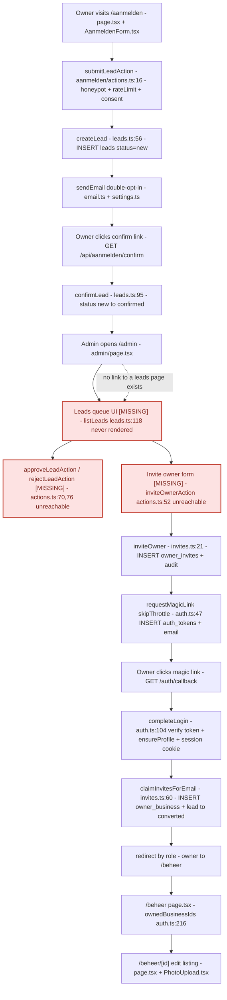
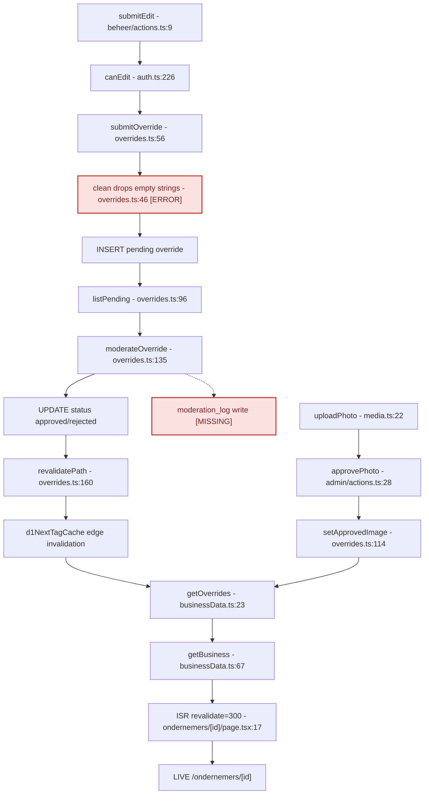
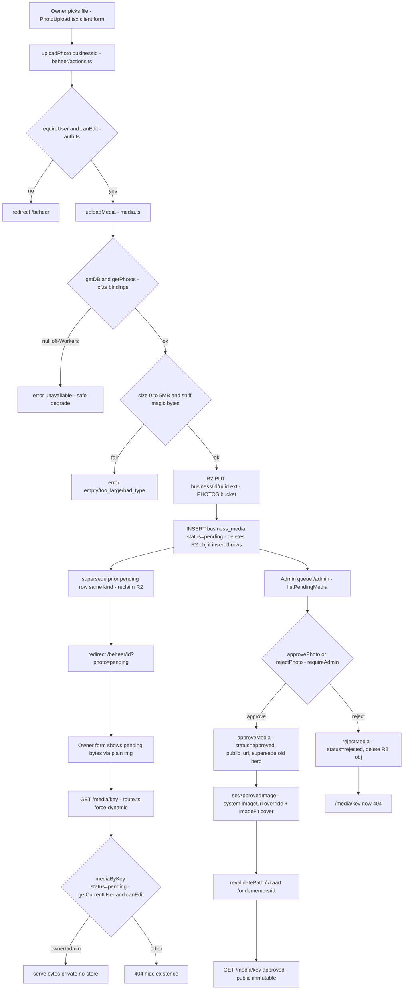
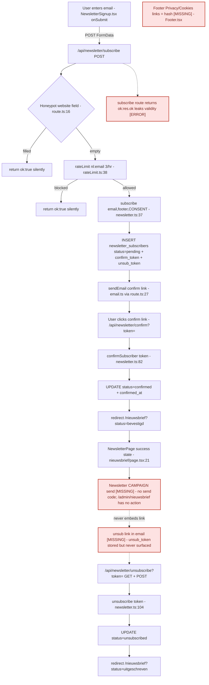
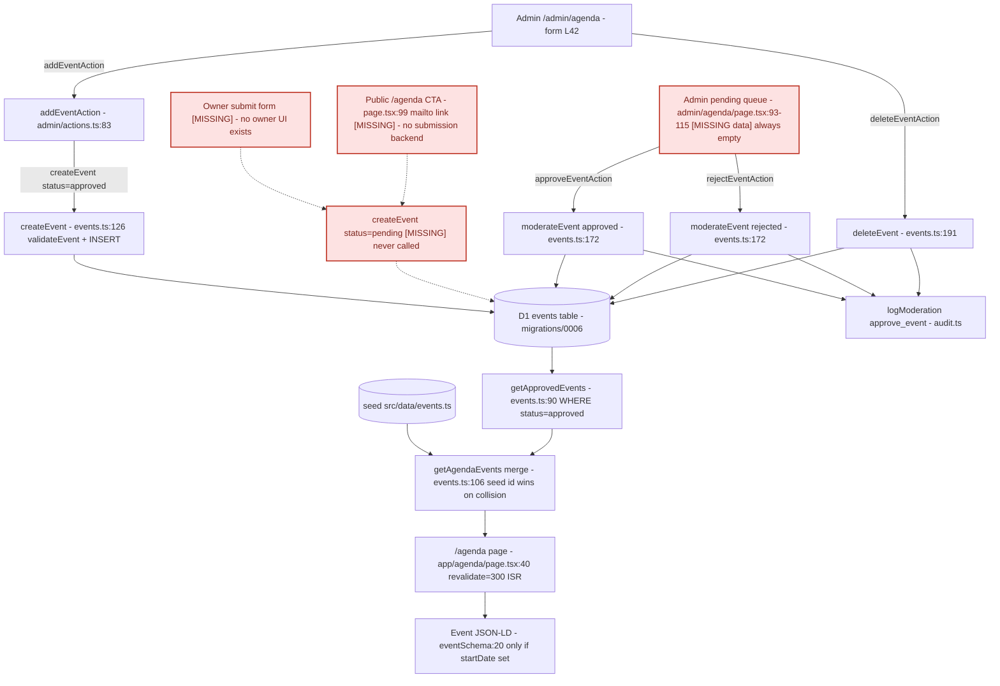
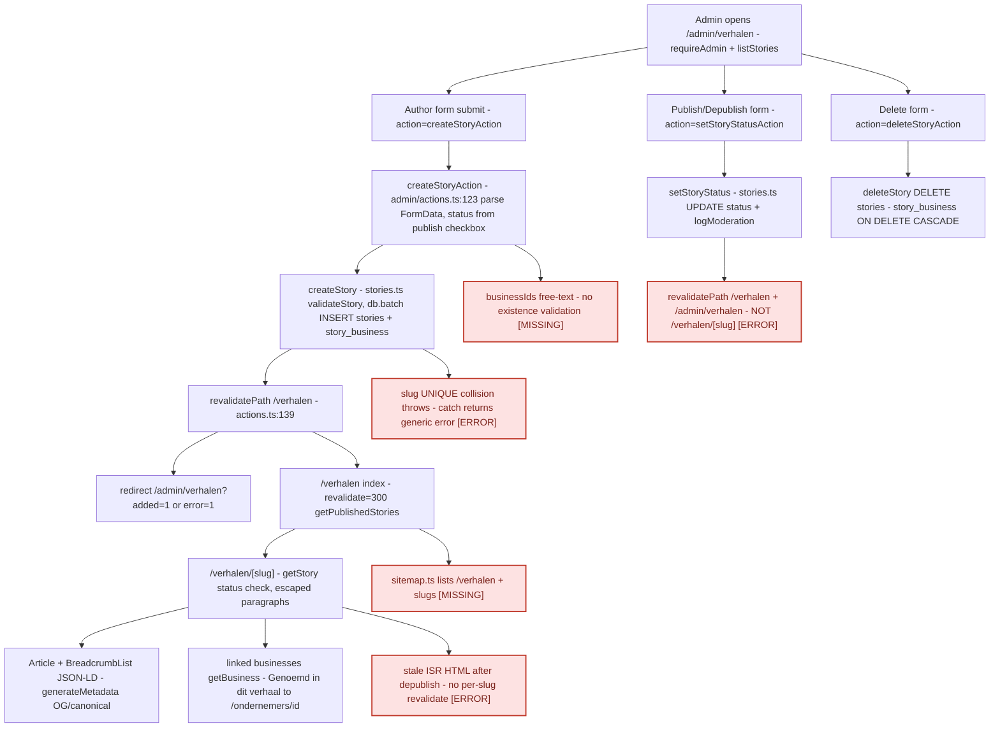
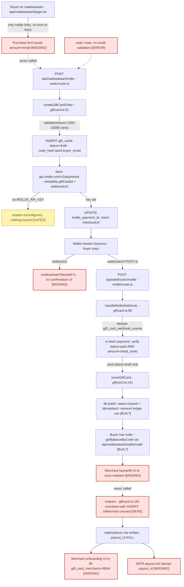
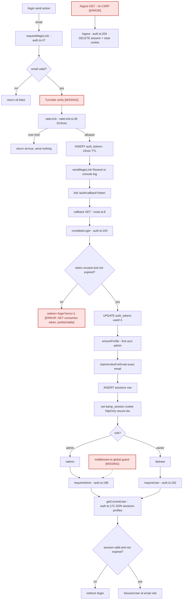
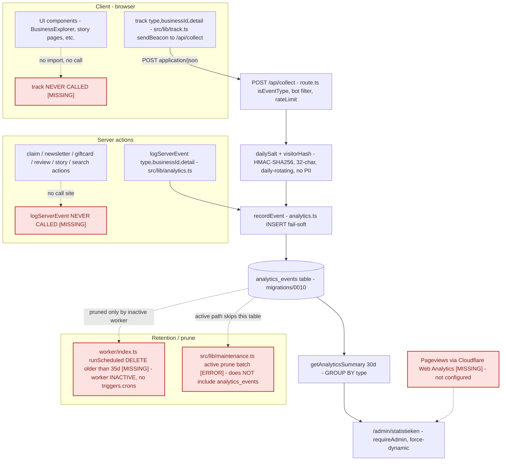

# Ondernemers van de Kamp — Flow Maps

This document is the owner's map for finding **real bugs**, **missing API calls / dead wiring**, and **security/GDPR/UX gaps** fast. Each section is one end-to-end flow: a summary, a Mermaid diagram, then three short lists — **Built ✅**, **Missing ⚠️**, **Errors ❌**.

## Legend

In every diagram, **solid arrows** are wiring that exists and runs today. **Dashed arrows** are connections that *should* exist but do not (an unwired UI element, a route nothing calls, a stub).

- A node labelled **`[MISSING]`** is a piece of the chain that does not exist in the code — typically a UI surface, a caller, or a job. The backend on the other side may be fully built, but nothing reaches it, so the flow is dead end-to-end.
- A node labelled **`[ERROR]`** is code that exists and runs but is **wrong** (a real bug, a security/GDPR defect, or a correctness/UX hazard).
- A node labelled **`[GATED]`** is intentionally inert (e.g. the gift-card feature with no `MOLLIE_API_KEY`) — shown for completeness, not scored as a defect.

Red-tinted nodes are Missing/Error. The **Gaps at a glance** table at the end aggregates every Missing and Error item across all flows with its flow and severity.

---

## 1. Owner onboarding (aanmelden → /beheer)

The two ends of the owner-onboarding chain are fully wired, but the **middle is dead**. Public side: `/aanmelden` → `submitLeadAction` (honeypot + per-email rate limit + consent) → `createLead` writes a `new` lead and emails a double-opt-in link → `/api/aanmelden/confirm` → `confirmLead` flips it to `confirmed` (idempotent). Login side: `requestMagicLink` → `/auth/callback` → `completeLogin` verifies the token, ensures a profile, calls `claimInvitesForEmail` (binds `owner_business` on **exact email match**, flips matching lead to `converted`, audits) and routes owner→`/beheer`. But the bridge between the two halves exists only as server actions with **no UI**: `src/app/admin/page.tsx` renders only pending overrides, pending media, and the GDPR purge form. It never lists leads (`listLeads` has zero callers) and never renders the invite form, so `inviteOwnerAction` / `approveLeadAction` / `rejectLeadAction` are unreachable. An admin literally cannot see a confirmed lead or send an invite from the app, so `claimInvitesForEmail` has nothing to claim and a real owner can never reach `/beheer` through this funnel. The backend is correct and secure; the **admin onboarding console is the missing piece**.

**Built ✅**
- `/aanmelden` renders `AanmeldenForm.tsx` with `action=submitLeadAction`; honeypot field `website`, required email + required consent checkbox.
- `submitLeadAction` (aanmelden/actions.ts:16): honeypot redirect, consent guard, per-email rateLimit 3/hr, `createLead`, double-opt-in email, always redirects to `?sent=1` (no enumeration).
- `createLead` (leads.ts:56): `validateLead` + INSERT `leads` status=`new`, consent stored verbatim, returns `confirmToken`.
- `GET /api/aanmelden/confirm` → `confirmLead` (leads.ts:95): idempotent flip `new`→`confirmed`, redirect `/aanmelden?confirmed=1`.
- `inviteOwner` (invites.ts:21): validates email + verifies business exists, atomic batch of `owner_invites` INSERT + moderation audit, 14-day TTL.
- `requestMagicLink` (auth.ts:47) `skipThrottle` bypasses anonymous login bucket for admin-issued invites.
- `completeLogin` (auth.ts:104): token verify, mark used, `ensureProfile` (first account bootstraps admin), `claimInvitesForEmail`, server-side session, httpOnly/secure/sameSite=lax cookie.
- `claimInvitesForEmail` (invites.ts:60): exact-email match is the isolation boundary; `INSERT OR IGNORE owner_business`, mark invite claimed, flip lead to `converted`, audit; idempotent.
- `/auth/callback` routes admin→`/admin`, owner→`/beheer`, else `/login?error=1`.
- `/beheer` lists owned businesses and links to `/beheer/[id]` editing surface.

**Missing ⚠️**
- **ADMIN LEADS QUEUE UI** — `listLeads` (leads.ts:118) has **zero callers** (grep confirms only its own definition). `admin/page.tsx` imports only `listPending`, `listPendingMedia`, `purgeBusinessData`. An admin can never see a `confirmed` lead. Fix: call `listLeads('confirmed')` / `listLeads('new')` in `admin/page.tsx` and render rows with approve/reject + an invite control.
- **OWNER INVITE FORM UI** — `inviteOwnerAction` (admin/actions.ts:52) is referenced by no rendered JSX. No `<form>` with `name=email` + `name=businessId` is wired to it. This is the single break that severs lead→ownership.
- `approveLeadAction` / `rejectLeadAction` (admin/actions.ts:70,76) are unreachable — no UI triggers `setLeadStatus`. They go live only once the leads queue UI is built.
- No admin navigation to any leads/aanmeldingen page (`admin/page.tsx` only links to `/admin/instellingen` and `/beheer`).
- Lead→business association gap: `createLead` carries an optional `business_id` but the public form never collects one, and there is no admin UI to map a confirmed lead's free-text `business_name` onto a real seed business id before inviting. `inviteOwner` requires a valid existing `businessId` (invites.ts:31 `getBusiness` check) — a picker UI that does not exist.

**Errors ❌**
- Status-transition mismatch: `approveLeadAction` sets `status='approved'`, while `claimInvitesForEmail` (invites.ts:83) flips the lead to `converted` on login. The claim UPDATE excludes only `rejected`, so it can overwrite `approved`→`converted` — order-dependent final status. Two writers, no single source of truth; reconcile once the UI exists.
- Lead↔invite email coupling unenforced: `inviteOwner` takes an arbitrary admin-typed email while `createLead` stored the applicant's email; nothing guarantees they match. When the invite form is built it must default to `lead.email`, or an owner gets bound to a typo'd address with no lead conversion.
- Minor UX: `/api/aanmelden/confirm` always redirects with `confirmed=1` or `0`, but `aanmelden/page.tsx` only special-cases `confirmed==='1'`. A failed confirm (`confirmed==='0'`, expired/invalid token) silently re-renders the blank form with no error message. Dead-end, not a security bug.

---

## 2. Owner edit → moderation → publish

Fully wired and works. `submitEdit` (gated by `canEdit`) inserts a pending `business_overrides` row via `submitOverride`. Admin approve/reject calls `moderateOverride` which sets status and `revalidatePath`. `getOverrides` merges `status=approved` rows newest-wins onto the seed in `getBusiness`. The live page reads via `getBusiness` with ISR `revalidate=300`; `d1NextTagCache` makes `revalidatePath` effective at the edge. Defects: override moderation never writes `moderation_log` though `audit.ts` exists; `clean()` drops empty strings so an owner cannot clear a field.

**Built ✅**
- `submitEdit` (beheer/actions.ts:9) → `canEdit` then `submitOverride` (overrides.ts:56) inserts pending.
- `moderateOverride` (overrides.ts:135) sets status; on approve `revalidatePath` (overrides.ts:160).
- `getOverrides` (businessData.ts:23) approved newest-wins; `getBusiness` (businessData.ts:67) onto seed; ISR=300; `d1NextTagCache`.
- Photo `uploadPhoto` → `approvePhoto` → `setApprovedImage` (overrides.ts:114).

**Missing ⚠️**
- No `moderation_log` write for override approve/reject; `audit.ts` unused by override/admin actions.
- No owner email on approve/reject; `moderateOverride` never notifies `submitted_by`.
- `clean` (overrides.ts:46) keeps only non-empty values, so an owner cannot clear a field.

**Errors ❌**
- `overrides.ts:46` — `clean` drops empty fields, so an owner cannot clear phone/email/website once set.
- `overrides.ts:135` + `admin/actions.ts:16,22` write no `moderation_log`; use `db.batch` with a moderation statement.
- Rejected path has no owner notification or audit.

---

## 3. Owner photo upload → R2 → moderation → gated /media serving

Fully wired end-to-end — UI, server action, R2 storage, magic-byte validation, D1 pending row, admin moderation queue, override-based publish, and an access-gated serving route. **No dead wiring and no Missing steps in this flow.** `PhotoUpload.tsx` posts the bound `uploadPhoto(businessId)` server action (re-checks `requireUser` + `canEdit`) → `uploadMedia()` validates size (≤5MB) and sniffs magic bytes (ext derived from detected MIME, never the client filename), PUTs to the `PHOTOS` R2 bucket, inserts a `pending` `business_media` row (deleting the R2 object if the insert throws), then `supersede()` retires the prior pending row of the same kind. Admins approve/reject at `/admin`; `approveMedia` flips to `approved`, sets `public_url`, supersedes the prior hero, and writes a system `approved` override via `setApprovedImage`. The serving route `/media/[...key]` (force-dynamic) gates pending bytes behind `canEdit`, serves approved bytes public+immutable, and 404s rejected/superseded. Idempotency is solid: only a `pending` row can be approved or rejected.

**Built ✅**
- `PhotoUpload.tsx`: client multipart form, accept allowlist, required, local preview, plain `img` for cookie-bearing pending bytes.
- `uploadPhoto` re-enforces auth (`requireUser` + `canEdit`) — not relying only on the page guard since server actions are directly POST-able (beheer/actions.ts:22-33).
- `uploadMedia`: 5MB cap + magic-byte sniff (jpeg/png/webp/avif); ext derived from **detected MIME**, never client filename/Content-Type (media.ts:102-142).
- R2 PUT to single `PHOTOS` bucket, immutable cacheControl; pending row inserted; R2 object deleted on INSERT failure (compensating cleanup).
- `supersede()`: exactly one live row per (business, kind), reclaims orphaned R2 objects.
- Admin moderation queue with thumbnails + approve/reject; `approvePhoto`/`rejectPhoto` behind `requireAdmin` + `revalidatePath`.
- `approveMedia` idempotent (only `pending` approvable), sets `public_url`, supersedes prior hero, calls `setApprovedImage` (system `approved` override `{imageUrl, imageFit:cover}` + revalidate /, /kaart, /ondernemers/[id]).
- `rejectMedia` idempotent — reclaims R2, cannot delete bytes of a live approved photo.
- Gated `/media/[...key]` force-dynamic: pending → owner/admin only, approved → public+immutable, rejected/superseded → 404.
- Off-Workers safe degrade: `getDB`/`getPhotos` return null → `unavailable`/503 instead of crashing.

**Missing ⚠️**
- *(none — this flow is complete end-to-end.)*

**Errors ❌**
- NIT (non-blocking): `migrations/0001_init.sql:42` comments the `business_media.status` enum as `pending | approved | rejected` but the code also uses `superseded` (media.ts:13,65). Column is TEXT so it works — update the stale comment.
- NIT (perf): `mediaByKey()` / the serving route look up by `r2_key` (media.ts:166) but the only index is `idx_media_business` on `(business_id, status)`. Every `/media/[...key]` hit is a full-table scan. Add `CREATE INDEX idx_media_r2key ON business_media(r2_key)` (UNIQUE would also harden against key collisions).
- OBSERVATION (theoretical): `uploadMedia` does the R2 PUT before the D1 insert and only deletes the object if the INSERT throws. If the Worker is killed between PUT and INSERT, the object is orphaned with no DB row. Bounded/rare; warrants a periodic R2-vs-D1 reconciliation sweep.

---

## 4. Google reviews (display + QR acquisition)

The **display half is fully wired**: admin sets a `place_id` at `/admin/google` via `setPlaceIdAction` → `setPlaceId` → `business_google`; the public business page renders `GoogleReviews.tsx`, which client-fetches `/api/reviews/[businessId]` (force-dynamic, no-store) → `getBusinessGoogle` + `fetchPlaceReviews` → Places API (New) using the Maps key from `/admin/instellingen`. Attribution + Maps link rendered, no `AggregateRating` schema, ToS-compliant. The **acquisition (QR) half is half-wired**: `/r/[token]` → `resolveReviewRequest` → `writeReviewUrl` deep link works, BUT `createReviewRequest` (the token minter) has **zero callers** — there is no admin/owner UI to generate a review-request token or print a QR card, so the funnel can never produce a working token except by manual D1 insert. One correctness issue: `GoogleReviews` is rendered **unconditionally** on every business page (page.tsx:76), ignoring the existing `hasGoogleReviews` flag, so a wasted `/api/reviews` fetch fires for every business with no `place_id` linked.

```mermaid
flowchart TD
  subgraph DISPLAY["Reviews DISPLAY - wired"]
    A["Admin /admin/google page.tsx"] -->|setPlaceIdAction| B["admin/actions.ts:64 setPlaceIdAction"]
    B --> C["reviews.ts:72 setPlaceId to business_google"]
    K["Maps key: /admin/instellingen saveSettingsAction"] --> L["settings.ts:85 getGoogleMapsKey"]
    D["ondernemers/[id]/page.tsx:76 GoogleReviews"] --> EE["GoogleReviews.tsx:46 fetch /api/reviews/id"]
    EE --> FF["api/reviews/[businessId]/route.ts GET force-dynamic no-store"]
    FF --> G["reviews.ts:39 getBusinessGoogle reads place_id"]
    C -.-> G
    G --> H["places.ts:63 fetchPlaceReviews"]
    L --> H
    H --> I["Places API New v1/places X-Goog-FieldMask"]
    I --> J["places.ts:43 parsePlaceDetails cap 5"]
    J --> MM["render reviews + Maps attribution link"]
    D2["page.tsx:76 renders unconditionally ignores hasGoogleReviews [ERROR]"] -.-> EE
  end
  subgraph ACQ["Review ACQUISITION QR funnel - gap"]
    NN["Owner/admin generate QR token UI [MISSING]"] -.->|no caller| OO["reviews.ts:100 createReviewRequest [MISSING wiring]"]
    OO --> PP["review_requests row token"]
    QQ["Visitor scans QR - GET /r/[token]"] --> RR["reviews.ts:116 resolveReviewRequest stamp scanned_at"]
    RR --> SS["reviews.ts:20 writeReviewUrl placeId"]
    SS --> TT["redirect search.google.com writereview"]
    RR -->|no placeId| UU["fallback redirect /ondernemers/id"]
  end
  classDef bad fill:#fde2e2,stroke:#c0392b,stroke-width:2px,color:#7b241c;
  class D2,NN,OO bad
```

**Built ✅**
- `/admin/google` renders a per-business `place_id` form, linked from `/admin/instellingen`.
- `setPlaceIdAction` (admin/actions.ts:64) → `setPlaceId` (reviews.ts:72) validates `place_id`, upserts `business_google`, logs moderation.
- Maps API key wired: `/admin/instellingen` `saveSettingsAction` → `getGoogleMapsKey` (settings.ts:85).
- `GoogleReviews` client-fetches `/api/reviews/[businessId]`.
- `/api/reviews/[businessId]` GET is force-dynamic + private no-store, returns **empty** when no `place_id` (ToS-safe, never cached).
- `fetchPlaceReviews` (places.ts:63) calls Places API New with `X-Goog-FieldMask`; `parsePlaceDetails` caps at 5.
- Display renders Google attribution + Maps link, emits **no** `AggregateRating` JSON-LD (correct self-serving avoidance).
- QR redirect `/r/[token]` → `resolveReviewRequest` stamps `scanned_at` → redirects to `writeReviewUrl`, with `/ondernemers/[id]` fallback when `placeId` missing.
- `gdpr.ts` purges `review_requests` on business deletion.

**Missing ⚠️**
- `createReviewRequest` (reviews.ts:100) has **zero callers** — no admin/owner UI mints review-request tokens, so no QR card / short link can be generated. The `/r/[token]` consumer exists but nothing produces a token. Acquisition funnel is non-functional end-to-end without manual D1 inserts.
- No QR-code generation / printable card UI anywhere — even if `createReviewRequest` were called, nothing turns a token into a scannable QR for the counter.
- GBP-OAuth path (`oauth_states` table, migration 0005) is provisioned but no owner-reply / GBP-connect flow is wired (`gbp_connected` always 0; consistent with the documented deferral).

**Errors ❌**
- `ondernemers/[id]/page.tsx:76` — `GoogleReviews` is rendered unconditionally for every business, ignoring `b.hasGoogleReviews` (already used by `BusinessDetailClient.tsx:45`). A client fetch to `/api/reviews/[id]` fires on **every** business page even with no `place_id`, returning empty each time. Fix: gate with `{business.hasGoogleReviews && <GoogleReviews .../>}`.
- `reviews.ts:127-130` — `resolveReviewRequest` stamps `scanned_at` only `WHERE scanned_at IS NULL` (first-scan-wins) and the token is never rate-limited, so it can be scanned/redirected unlimited times. Low severity; undocumented.

---

## 5. Newsletter double-opt-in: subscribe → confirm → unsubscribe

The subscribe and confirm legs are fully wired end-to-end. `NewsletterSignup.tsx` (in `Footer.tsx` and on `/nieuwsbrief`) POSTs FormData to `/api/newsletter/subscribe`, which checks the honeypot, rate-limits (3/hr per email), calls `subscribe()` to insert a `pending` row with a `confirm_token`, and emails the confirm link. The confirm GET route calls `confirmSubscriber()` and redirects to `/nieuwsbrief?status=bevestigd`. The **unsubscribe leg is real code but dead wiring**: `unsub_token` is generated and stored (migration 0007) and `/api/newsletter/unsubscribe` has working GET + RFC 8058 POST handlers, but **nothing outside `newsletter.ts` references `unsub_token`**. There is no newsletter-send/campaign code anywhere, no email embeds the unsubscribe link, and no `List-Unsubscribe` header is set. A confirmed subscriber can never actually reach the unsubscribe endpoint. `/admin/nieuwsbrief` only lists and counts subscribers; it has no send action.

**Built ✅**
- `NewsletterSignup.tsx` → `fetch POST /api/newsletter/subscribe` (FormData incl. honeypot).
- Rendered in `Footer.tsx:80` (variant=dark) and `nieuwsbrief/page.tsx:39,49`.
- `subscribe/route.ts`: honeypot (line 16) → rateLimit (line 20, 3/hr per email) → `subscribe()` → `sendEmail` confirm link.
- `subscribe()`: anti-enumeration (always ok normally), inserts pending row with `confirm_token` + `unsub_token`, logs `subscriber_events`, re-opt-in path for pending rows, refuses confirmed/bounced.
- `sendEmail` builds confirm URL from `getConfiguredSiteUrl` with fallback base.
- `/api/newsletter/confirm` GET → `confirmSubscriber()` → UPDATE `confirmed` → redirect (idempotent, refuses bounced/unsubscribed).
- `/api/newsletter/unsubscribe` GET + RFC 8058 POST handlers exist and call `unsubscribe()`.
- `nieuwsbrief/page.tsx` renders bevestigd / uitgeschreven / mislukt states from `?status`.
- Migration 0007 schema matches all code (`newsletter_subscribers` + `subscriber_events` with ON DELETE CASCADE).
- `/admin/nieuwsbrief` lists subscribers + counts (read-only).

**Missing ⚠️**
- **NEWSLETTER SEND / CAMPAIGN is entirely missing** — no code sends a newsletter to confirmed subscribers; `/admin/nieuwsbrief/page.tsx` has no send action.
- **UNSUBSCRIBE LINK IS DEAD WIRING** — `unsub_token` is generated/stored (newsletter.ts:72) but referenced only inside `newsletter.ts`. No email/campaign embeds `/api/newsletter/unsubscribe?token=`, so the working GET/POST handlers are unreachable. GDPR/CAN-SPAM risk once sends go live.
- No `List-Unsubscribe` / `List-Unsubscribe-Post` header anywhere (`email.ts` has none) even though the POST route claims RFC 8058 support.
- Footer `Privacy` / `Cookiestatements` links remain `#` (`Footer.tsx`).

**Errors ❌**
- `subscribe/route.ts:18-23` — with no email submitted, `email` becomes `''` and rateLimit is keyed on `nl:email:` (empty), so all empty-key callers share one 3/hr bucket; `subscribe()` returns `{ok:false}` for the invalid empty email and the route returns `{ok:false}` (line 36), flipping the client to the error state. This **leaks validity** and breaks the otherwise-consistent anti-enumeration design. Fix: validate email early, return a uniform `{ok:true}` (or a client-only 400 for empty), and normalize rate-limit when email is empty.
- `unsubscribe/route.ts:14-18` — POST advertises RFC 8058 one-click but the corresponding `List-Unsubscribe-Post: List-Unsubscribe=One-Click` email header is never emitted, so mail clients never invoke it. Dead until a campaign sender sets the header.

---

## 6. Events / agenda

Admin-curated agenda is fully wired end-to-end: `/admin/agenda` form → `addEventAction` → `createEvent(status:"approved")` → D1 `events`; `getAgendaEvents` merges the curated seed (`src/data/events.ts`) with approved D1 rows; `/agenda` renders them and emits Event JSON-LD (only for rows with a `startDate`). Moderation actions (approve/reject/delete) call `moderateEvent`/`deleteEvent` and log to `moderation_log`. The **missing piece is owner self-submission**: nothing ever creates a `status:"pending"` event (`addEventAction` hardcodes `"approved"` at actions.ts:96), so the admin "Ter goedkeuring" moderation queue and the `moderateEvent("approved")` path are **dead UI** — the pending list is always empty. The public `/agenda` "Meld je evenement aan" CTA is a `mailto:` link, not a backend submission form.

**Built ✅**
- `/admin/agenda` form (page.tsx:42) → `addEventAction` (actions.ts:83) → `createEvent(input,'approved',admin.id)` (actions.ts:96); INSERTs into D1 `events` with `validateEvent` guard.
- `validateEvent` rejects bad categories, non-`http(s)` URLs (no `javascript:` XSS), impossible/round-trip-checked dates, end-before-start.
- `approveEventAction`/`rejectEventAction` → `moderateEvent` updates status + writes `moderation_log`.
- `deleteEventAction` → `deleteEvent` + `logModeration delete_event`.
- `getApprovedEvents` (status=`approved`, build-hermetic returning `[]` during `phase-production-build`).
- `getAgendaEvents` merges curated seed + approved D1 rows, seed id wins on collision.
- `/agenda` renders merged events with `revalidate=300` ISR, emits Event JSON-LD via `eventSchema` for dated rows only.
- Both `/agenda` and `addEventAction` call `revalidatePath('/agenda')`.

**Missing ⚠️**
- Owner event self-submission UI is missing (confirmed known gap): no route/form creates a `status='pending'` event. `addEventAction` hardcodes `'approved'` and `createEvent` is never called with `'pending'`.
- Consequence: the admin "Ter goedkeuring (pending)" queue (admin/agenda/page.tsx:93-115) is **dead UI** — `listEvents` filters `status==='pending'` but no path ever produces a pending row, so the section never renders. The `moderateEvent('approved')` branch is unreachable in practice.
- Public `/agenda` "Meld je evenement aan" CTA (agenda/page.tsx:99-101) is a `mailto:` link only — no backend submission form, no double-opt-in like `/aanmelden` has.
- Individual events are not in `sitemap.ts` beyond the static `/agenda` entry. Acceptable (events have no detail pages) but worth noting for SEO of dated events.

**Errors ❌**
- *(none — the wired admin path is correct.)*

---

## 7. Owner-story: admin author → publish → /verhalen + /verhalen/[slug]

Fully wired and functional. Admin authors a story at `/admin/verhalen` via `createStoryAction`, which validates and INSERTs into D1 `stories` plus `story_business` link rows using `db.batch` (edge-safe, no interactive txn). Publish/depublish/delete toggle status via `setStoryStatusAction`/`deleteStoryAction`. The public index `/verhalen` reads `getPublishedStories` (ISR revalidate=300); the detail page `/verhalen/[slug]` reads `getStory`, renders blank-line-split **escaped** paragraphs (no HTML injection), emits Article + BreadcrumbList JSON-LD, and resolves linked businesses via `getBusiness`. No dead wiring on the core path. Real gaps: stories are absent from `sitemap.ts` (SEO/AEO loss), per-slug ISR pages are never revalidated on status change (stale published HTML up to 5 min after depublish), slug-collision and bad business-id failures are swallowed into a generic admin error.

**Built ✅**
- `/admin/verhalen` gated by `requireAdmin`, renders create form + list with publish/depublish/delete forms.
- `createStoryAction` (actions.ts:123) parses FormData incl. comma-split `businessIds`, sets status from publish checkbox, calls `createStory`, `revalidatePath('/verhalen')`, redirects with added/error flag.
- `createStory` validates via `validateStory`, edge-safe `db.batch` INSERT into `stories` + `INSERT OR IGNORE` into `story_business`, sets `published_at` on publish.
- `setStoryStatusAction` + `setStoryStatus`: UPDATE status with conditional `published_at`, `logModeration` audit.
- `deleteStoryAction` + `deleteStory`: DELETE with `story_business ON DELETE CASCADE` (migration 0008), `logModeration`.
- `/verhalen` index (revalidate=300) → `getPublishedStories`, renders cards + empty state + BreadcrumbList JSON-LD.
- `/verhalen/[slug]` → `getStory`, enforces `status==='published'` else `notFound`, renders blank-line-split React-escaped paragraphs (no XSS surface).
- Article JSON-LD (headline/datePublished/dateModified/author/publisher/image/mainEntityOfPage) + `generateMetadata` canonical+OG article.
- Linked businesses resolved via `getBusiness`, rendered as "Genoemd in dit verhaal" pills.

**Missing ⚠️**
- `sitemap.ts` does NOT include `/verhalen` index nor any `/verhalen/[slug]` URLs — published stories are invisible to the sitemap (the static-pages list omits `/verhalen` entirely). Fix: loop `getPublishedStories()` producing `{base}/verhalen/{slug}` entries plus the index.
- `businessIds` in the admin form (actions.ts:132) are free-text, inserted with no validation against existing business ids. A typo creates an orphan `story_business` row that `getBusiness` silently filters out, with no admin feedback. Fix: validate each id before insert and surface unknown ids.
- No per-slug revalidation: the actions only `revalidatePath('/verhalen')` (index), never `revalidatePath('/verhalen/${slug}')`.

**Errors ❌**
- **Stale published HTML after depublish/delete**: `/verhalen/[slug]` uses ISR revalidate=300 and the actions never revalidate the individual slug path, so a depublished/deleted story's cached HTML can be served for up to 5 minutes (the status guard in `getStory` only runs on a cache MISS). Real cache-coherence bug — `revalidatePath('/verhalen/${slug}')` in `setStoryStatusAction`/`deleteStoryAction` (requires threading the slug, which `deleteStory` does not currently load).
- **Silent slug-collision failure**: `slug` is UNIQUE (migration 0008). A duplicate slug throws inside `createStory`, is swallowed by the catch returning `{ok:false}`, and the admin sees only the generic "Controleer titel, tekst en de slug/afbeelding" message. Fix: detect the UNIQUE constraint failure and return a distinct "slug bestaat al" error.
- `setStoryStatusAction` accepts `status='archived'` (actions.ts:146) and writes it, but the UI exposes no archive control and the read paths treat archived as not-published — reachable only via a crafted POST. Dead/partial wiring on the status enum.

---

## 8. Cadeaukaart gift-card: purchase → Mollie → webhook → issue → redeem → payout

The **middle of the chain is fully wired and sound**: `POST /api/cadeaukaart/order` → `createGiftCardOrder` (draft card + Mollie payment, fail-soft when no key) → Mollie hosted checkout → `POST /api/webhooks/mollie` → `handleMollieWebhook` (re-fetches the payment, never trusts the POST body, dedupes via `gift_card_webhook_events`, guards `status==paid` and `amount==initial_cents`) → `issueGiftCard` (db.batch flips draft→issued and writes one idempotent +amount ledger row). Balance/redeem core logic is overdraw-safe via a single conditional `INSERT...SELECT...WHERE` plus a UNIQUE `idempotency_key`. But **both ends are dead wiring**. `/cadeaukaart/page.tsx` has only `mailto:` links and NO form or fetch to `/api/cadeaukaart/order`, so the purchase UI is missing. There is NO kassa/redeem UI, NO merchant-onboarding UI, and NO payout route anywhere under `src/app`. `redeem()` and `isMerchant()` are exported but called by nothing. The whole feature is legally gated and inert (no `MOLLIE_API_KEY` = fail-soft), which is intended. Two real issues beyond the known deferred gaps: (1) `gift_card_merchants` has NO UI anywhere to populate it, so even a future kassa would have no valid merchant id and `isMerchant` would always return false; (2) the order route accepts a blank/invalid email with no format validation.

**Built ✅**
- `POST /api/cadeaukaart/order` → `createGiftCardOrder`: parses amount+email, returns `checkoutUrl` JSON. Wired.
- `createGiftCardOrder` (giftcard.ts:51): `validateAmount` 10-150 EUR, inserts draft `gift_cards` row with SHA-256 `code_hash` + `last4`, creates Mollie payment with `metadata.giftCardId` + `webhookUrl`, stores `mollie_payment_id`. Fail-soft when no key.
- `POST /api/webhooks/mollie` → `handleMollieWebhook`: reads form id, always returns 200. Wired.
- `handleMollieWebhook` (giftcard.ts:99): dedupes via `gift_card_webhook_events`, re-fetches payment (never trusts body), guards `status==paid` and `paidCents==initial_cents` and `card.status==draft` before issuing. Strong webhook security.
- `issueGiftCard` (giftcard.ts:141): `db.batch` flips draft→issued and writes one +amount ledger row guarded by UNIQUE `idempotency_key issue:<id>`. Idempotent and replay-safe.
- `getBalanceByCode` + `GET /api/cadeaukaart/saldo/[code]`: balance = SUM(ledger.amount_cents), rate-limited 10/hr per code (guessing-oracle defense), no-store. Wired.
- `redeem()` core logic (giftcard.ts:183): overdraw-safe single conditional `INSERT...SELECT...WHERE` on live SUM, UNIQUE `idempotency_key` blocks double-spend. Logic correct (but never invoked by any UI).
- Migration 0009: `gift_cards`, `gift_card_ledger` (append-only), `redemptions` (`payout_id` ready), `gift_card_merchants` (IBAN), `gift_card_webhook_events`. Schema complete.

**Missing ⚠️**
- **PURCHASE UI**: `/cadeaukaart/page.tsx` has only `mailto:` links (lines 66-72, 172). No form, no client component, no fetch to `/api/cadeaukaart/order`. The order route is reachable by nothing. (known deferred, confirmed)
- **POST-PURCHASE CONFIRMATION**: `redirectUrl` is `/cadeaukaart?besteld=1` (giftcard.ts:80) but the page never reads `besteld`, so the buyer sees no confirmation / no delivered code.
- **KASSA / REDEEM UI**: no `/beheer/kassa` route. `src/app/beheer` holds only `actions.ts`, `page.tsx`, `[id]/page.tsx`, `[id]/PhotoUpload.tsx`. `redeem()` and `isMerchant()` are exported but called by zero callers. (known deferred, confirmed)
- **MERCHANT ONBOARDING UI**: `gift_card_merchants` (business_id, iban, display_name, active) has NO insert path anywhere in `src/app` or `src/components`. So `isMerchant()` can only ever return false and `redeem()` could never be passed a valid `merchantBusinessId` even if a kassa existed. Deeper gap than just kassa UI.
- **SEPA PAYOUT**: `redemptions.payout_id` exists but no route, job, or function ever stamps it. `worker/index.ts` cron is inactive. (known deferred, confirmed)
- No admin screen to mark a merchant active or list outstanding redemptions for settlement; only `giftCardStats()` aggregates are surfaced on `/admin/statistieken`.

**Errors ❌**
- `app/api/cadeaukaart/order/route.ts:10-11` — `email` is `String(fd.get('email') ?? '')` passed straight to `createGiftCardOrder`, which only does `.trim().toLowerCase()`. **No format/non-empty validation.** A blank/malformed email yields an issued gift card with no deliverable buyer contact (GDPR/delivery concern). Fix: validate a basic email regex / reject empty in the route, return `reason 'bad_email'`.
- `giftcard.ts:73 / route.ts:9` — `amount` is `Math.round(Number(...) * 100)`; non-numeric → 0 (rejected gracefully as `bad_amount`), but floats like `10.005` silently round. Minor; validate against the offered tiers server-side when the purchase UI is built.
- **Dead wiring**: `redeem()` and `isMerchant()` (giftcard.ts:183,228) are exported and unit-tested but have no caller. The redemption half of the ledger can never execute in production, so the +issue side can grow with no -redeem side. Acceptable only because the feature is legally gated/inert.
- `handleMollieWebhook` swallows all errors (giftcard.ts:134) and the route always returns 200 (intentional — Mollie retries), but a persistent DB failure during issue is invisible (no alerting/dead-letter). Recommend logging when `status==paid` but `issueGiftCard` cannot complete.

---

## 9. Auth + session lifecycle

Magic-link auth + server-side D1 sessions is wired end-to-end and works. `/login` server action → `requestMagicLink` (auth.ts:47), rate-limited 5/15min per email via D1 `rate_limit` (fail-open), inserts `auth_tokens`, emails or `console.log`s a `/auth/callback?token=` link. The callback GET → `completeLogin` (auth.ts:104): validates one-time token (used+expiry), marks used, `ensureProfile` (first-account-becomes-admin bootstrap), `claimInvitesForEmail` by exact email, inserts a `sessions` row, sets httpOnly+secure+sameSite=lax `kamp_session` cookie, redirects admin→`/admin` owner→`/beheer` fail→`/login?error=1`. `getCurrentUser` (auth.ts:172) JOINs sessions→profiles with expiry; `requireUser` redirects `/login`, `requireAdmin` redirects non-admins to `/beheer`. `logout` (auth.ts:204) deletes the session row + clears the cookie. No happy-path bugs. Gaps: Turnstile is named in comments but NOT in the login form; no `middleware.ts` so protection depends entirely on per-route `require*` calls. `/logout` and `/auth/callback` are GET (no CSRF token); no purge job for expired tokens/sessions.

**Built ✅**
- `/login` server action → `requestMagicLink` (login/page.tsx:17-21).
- rateLimit 5/15min per email, fail-open (rateLimit.ts:38, called auth.ts:61-64).
- `auth_tokens` insert with 15min TTL (auth.ts:66-73).
- `sendMagicLink` via Resend with `console.log` fallback (auth.ts:80-100).
- `/auth/callback?token` GET → `completeLogin` (callback/route.ts:6-12).
- One-time token validation: used + expiry checks (auth.ts:108-114).
- `ensureProfile` with first-account-becomes-admin bootstrap (auth.ts:141-166).
- `claimInvitesForEmail` binds owner invites on exact email at login (auth.ts:119).
- `sessions` row insert + `kamp_session` httpOnly/secure/sameSite=lax cookie (auth.ts:120-134).
- Role-based redirect admin→`/admin` owner→`/beheer`.
- `getCurrentUser` sessions→profiles JOIN with expiry check (auth.ts:172-190).
- `requireUser` redirect `/login`, `requireAdmin` redirect non-admins `/beheer`.
- `logout` deletes session row + clears cookie, wired to `/logout`.
- All accessors degrade to logged-out when D1 unbound.

**Missing ⚠️**
- Turnstile/CAPTCHA on `/login`: referenced in comments (rateLimit.ts:5, auth.ts:57) but no `cf-turnstile` widget or server-side `siteverify` exists; only the D1 rate limiter is real.
- No `middleware.ts`: every protected route must remember to call `requireUser`/`requireAdmin`; no global guard, so a new `/admin` or `/beheer` page that forgets the call is silently public.
- No purge/cleanup job for expired/used `auth_tokens` and expired `sessions`; the cron worker is inactive and does not sweep these tables.

**Errors ❌**
- `/auth/callback` is a GET that consumes the one-time token (auth.ts:114 `UPDATE used=1`) with no CSRF protection: any third-party page that triggers a GET (email-client/proxy prefetch, `` with the URL) can pre-consume the token before the user clicks, causing a `/login?error=1` dead link. Mitigate by requiring POST or a confirm-click interstitial.
- `/logout` is a GET route (logout/route.ts:6) with no CSRF token, so a forged GET (e.g. ``) silently logs the user out. Make it a POST action.
- `completeLogin` does not regenerate/invalidate prior sessions, and combined with the `COUNT(*)` admin-bootstrap (auth.ts:155-158), if all admin profiles are ever deleted the next arbitrary login is silently elevated to admin. Low risk; gate to a configured allowlist.

---

## 10. Analytics (cookieless event pipeline)

The **server-side ingestion pipeline is fully wired and correct**: `POST /api/collect` validates the event type, runs a bot filter + per-IP rate limit, derives a daily-salted HMAC visitor hash (no IP/UA stored), and inserts into `analytics_events`; `/admin/statistieken` reads it back via `getAnalyticsSummary`. The pipeline is GDPR-sound (cookieless, daily-rotating salt, fail-soft inserts). BUT **the entire client side is dead**: `track()` in `src/lib/track.ts` is defined and points at `/api/collect`, yet it is imported/called **nowhere** (the only textual hit is the literal `track()` string in the statistieken page copy). Equally, `logServerEvent()` has **zero callers**, so server-origin conversion events (claim, newsletter_confirm, giftcard_paid, review_scan, story_view, search) are never emitted. Net result: `analytics_events` will only ever receive rows if `track()` is wired up later. Pageviews are absent (intended to come from Cloudflare Web Analytics, not yet configured). Finally, the 35-day retention prune lives ONLY in the **inactive** `worker/index.ts`; the **active** `src/lib/maintenance.ts` does NOT prune `analytics_events`, so even when the maintenance path runs, this table grows unbounded.

**Built ✅**
- `POST /api/collect` fully wired: type validation via `isEventType`, UA bot filter, per-IP `rateLimit(db, collect:ip, 200/hr)`, returns 204 always (no info leak).
- Cookieless visitor hashing: `dailySalt()` + `visitorHash()` produce a daily-rotating 32-char HMAC of secret/IP|UA; no IP, UA, or cookie persisted.
- `recordEvent()` INSERT into `analytics_events` is fail-soft; `detail` JSON-stringified, `businessId` truncated to 80 chars.
- `analytics_events` table + indexes exist (migration 0010) with idx on `created_at` and `(type, created_at)`.
- Read path: `getAnalyticsSummary(30)` → `/admin/statistieken` (requireAdmin, force-dynamic, noindex) renders per-type counts + gift-card stats.
- `track()` client beacon (track.ts) is correctly implemented (sendBeacon + fetch keepalive fallback, SSR guard) and targets the right route — it just has no callers.
- `worker/index.ts runScheduled()` DOES contain the correct 35-day DELETE retention SQL (just gated behind the inactive worker).

**Missing ⚠️**
- `track()` is NEVER imported or called anywhere in `src` (only textual mention is UI copy in `statistieken/page.tsx:35`). No client-side conversion events are ever emitted — the whole client beacon is dead wiring.
- `logServerEvent()` has ZERO call sites — server-origin events (claim, newsletter_confirm, giftcard_paid, review_scan, story_view) are never logged. Quick fix: call `logServerEvent('claim', businessId)` in the claim flow, `'newsletter_confirm'` in the confirm route, `'giftcard_paid'` in the Mollie webhook, `'review_scan'` in `/r/[token]`.
- Pageview events intended from Cloudflare Web Analytics, which is not configured — the `pageview` tile on `/admin/statistieken` will always read 0.
- Cron prune is effectively absent for production: `worker/index.ts` is INACTIVE (`wrangler.jsonc` still has `main: .open-next/worker.js` and no `triggers.crons`), so the 35-day analytics retention never runs.

**Errors ❌**
- **RETENTION GAP / GDPR data-minimisation**: `src/lib/maintenance.ts` (the active prune batch) prunes `auth_tokens`, `sessions`, `rate_limit`, `leads`, `owner_invites`, `newsletter_subscribers` but **does NOT prune `analytics_events`**. The 35-day delete exists ONLY in the inactive `worker/index.ts`. So even if `runMaintenance()` is activated, `analytics_events` grows unbounded. Fix: add `{ sql: "DELETE FROM analytics_events WHERE created_at < ?", params: [now - 35*DAY_MS] }` to the `maintenance.ts` batch.
- Minor consistency: `worker/index.ts` uses a 35-day window while migration 0010 comment says "<= ~35 days" — fine, but `maintenance.ts` and the worker now diverge on which tables they prune (two sources of truth for the nightly batch).

---

## Gaps at a glance

Severity key: **High** = breaks a core flow end-to-end, a security hole, or a GDPR/legal exposure once live. **Medium** = real bug or notable UX/SEO loss, flow still partially works. **Low** = nit, hardening, or theoretical.

| # | Flow | Gap | Type | Severity |
|---|------|-----|------|----------|
| 1 | Owner onboarding | Admin **leads queue UI** — `listLeads` has zero callers; `/admin` never lists confirmed leads | Missing | High |
| 2 | Owner onboarding | **Owner invite form UI** — `inviteOwnerAction` referenced by no JSX; severs lead→ownership | Missing | High |
| 3 | Owner onboarding | `approveLeadAction`/`rejectLeadAction` unreachable (no UI) | Missing | High |
| 4 | Owner onboarding | No admin nav/route to any leads page | Missing | Medium |
| 5 | Owner onboarding | No UI to map free-text `business_name` → real business id before invite | Missing | Medium |
| 6 | Owner onboarding | Lead lifecycle has two writers (`approved` vs `converted`), order-dependent | Error | Low |
| 7 | Owner onboarding | Invite email not coupled to lead email (typo binds wrong owner) | Error | Medium |
| 8 | Owner onboarding | Failed confirm (`confirmed=0`) silently re-renders blank form, no error | Error | Low |
| 9 | Owner edit→publish | No `moderation_log` write on override approve/reject | Missing | Medium |
| 10 | Owner edit→publish | No owner email notification on approve/reject | Missing | Low |
| 11 | Owner edit→publish | `clean()` drops empty strings — owner cannot clear phone/email/website | Error | Medium |
| 12 | Photo upload | `business_media.status` schema comment stale (omits `superseded`) | Error (nit) | Low |
| 13 | Photo upload | No index on `business_media.r2_key` — full-table scan per `/media` hit | Error (perf) | Low |
| 14 | Photo upload | R2 PUT before D1 insert can orphan an object if Worker dies between | Error (obs) | Low |
| 15 | Google reviews | **`createReviewRequest` has zero callers** — QR acquisition funnel non-functional | Missing | Medium |
| 16 | Google reviews | No QR-code generation / printable card UI | Missing | Medium |
| 17 | Google reviews | GBP-OAuth provisioned but no connect/reply flow (deferred) | Missing | Low |
| 18 | Google reviews | `GoogleReviews` rendered unconditionally — wasted `/api/reviews` fetch on every business | Error | Medium |
| 19 | Google reviews | `/r/[token]` re-scan stamping first-scan-wins, no rate limit | Error | Low |
| 20 | Newsletter | **Newsletter send/campaign entirely missing** | Missing | Medium |
| 21 | Newsletter | **Unsubscribe link dead wiring** — `unsub_token` never surfaced; GDPR/CAN-SPAM risk once live | Missing | High |
| 22 | Newsletter | No `List-Unsubscribe` / `List-Unsubscribe-Post` header | Missing | Medium |
| 23 | Newsletter | Footer Privacy/Cookiestatements links are `#` | Missing | Medium |
| 24 | Newsletter | Empty-email path returns `{ok:false}` → leaks validity, breaks anti-enumeration | Error | Medium |
| 25 | Newsletter | RFC 8058 POST advertised but header never emitted (endpoint dead) | Error | Low |
| 26 | Events/agenda | **Owner event self-submission UI missing** — no `pending` event ever created | Missing | Medium |
| 27 | Events/agenda | Admin "Ter goedkeuring" pending queue is dead UI (always empty) | Missing | Low |
| 28 | Events/agenda | Public `/agenda` CTA is a `mailto:` only, no backend | Missing | Low |
| 29 | Events/agenda | Individual events not in `sitemap.ts` | Missing | Low |
| 30 | Owner-story | Stories absent from `sitemap.ts` (index + slugs) | Missing | Medium |
| 31 | Owner-story | `businessIds` free-text, no existence validation → silent orphan link | Missing | Low |
| 32 | Owner-story | No per-slug revalidation on status change | Missing | Medium |
| 33 | Owner-story | **Stale published HTML up to 5 min after depublish/delete** | Error | Medium |
| 34 | Owner-story | Slug-collision swallowed into misleading generic error | Error | Low |
| 35 | Owner-story | `archived` status writable via crafted POST, no UI control | Error | Low |
| 36 | Cadeaukaart | **Purchase UI missing** — `/cadeaukaart` only `mailto:`, order route unreachable | Missing | High |
| 37 | Cadeaukaart | Post-purchase confirmation (`besteld=1`) never read | Missing | Medium |
| 38 | Cadeaukaart | **Kassa/redeem UI missing** — `redeem()`/`isMerchant()` zero callers | Missing | High |
| 39 | Cadeaukaart | **Merchant onboarding UI missing** — `gift_card_merchants` no insert path; `isMerchant` always false | Missing | High |
| 40 | Cadeaukaart | SEPA payout route/job missing — `payout_id` never stamped | Missing | High |
| 41 | Cadeaukaart | No admin merchant-activation / settlement screen | Missing | Medium |
| 42 | Cadeaukaart | Order route accepts blank/invalid email, no validation (GDPR/delivery) | Error | Medium |
| 43 | Cadeaukaart | Float amount silently rounds; no tier validation server-side | Error | Low |
| 44 | Cadeaukaart | `redeem()`/`isMerchant()` dead — redemption half can never execute | Error | Medium |
| 45 | Cadeaukaart | Webhook swallows errors with no alerting/dead-letter on issue failure | Error | Low |
| 46 | Auth | **No Turnstile/CAPTCHA** on `/login` (comments only) | Missing | Medium |
| 47 | Auth | **No `middleware.ts`** global guard — forgotten `require*` = silently public route | Missing | High |
| 48 | Auth | No purge job for expired/used `auth_tokens` + `sessions` | Missing | Medium |
| 49 | Auth | `/auth/callback` GET consumes one-time token, prefetch can pre-consume it | Error | Medium |
| 50 | Auth | `/logout` GET, no CSRF — forged GET logs user out | Error | Medium |
| 51 | Auth | Admin-bootstrap can silently elevate next login if all admins deleted | Error | Low |
| 52 | Analytics | **`track()` never called** — entire client beacon dead wiring | Missing | Medium |
| 53 | Analytics | **`logServerEvent()` zero callers** — no server-origin conversions logged | Missing | Medium |
| 54 | Analytics | Pageviews (Cloudflare Web Analytics) not configured — tile always 0 | Missing | Low |
| 55 | Analytics | Cron prune inactive (`worker/index.ts` not the deployed entry) | Missing | Medium |
| 56 | Analytics | **`maintenance.ts` does NOT prune `analytics_events`** — GDPR retention gap, unbounded growth | Error | High |
| 57 | Analytics | `maintenance.ts` vs `worker/index.ts` diverge on pruned tables (two sources of truth) | Error | Low |
