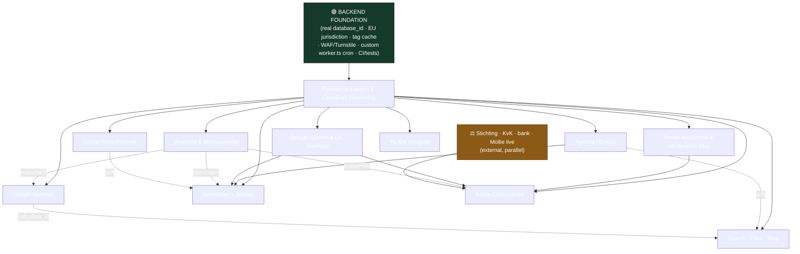

# Ondernemers van de Kamp — Product Roadmap

> **The local guide to every business on De Kamp** — the independent shopping & hospitality district in the historic centre of Amersfoort. ~67 verified active businesses. Target domain: **ondernemersvandekamp.nl**. Audiences: locals & visitors (B2C), the business owners who self-manage their listing (B2B), and the district association / admin who curates and moderates.

---

## How to read this document

This is the **master roadmap** — the single map that ties every epic, playbook, and team together. It is deliberately **backend-first**, per the owner's directive: *the backend architecture/plan is the headline deliverable.*

- **Start with the backend plan.** Everything in Phase 0 and the data-layer foundations for every later phase live there:
  **➡️ [BACKEND_MASTER_PLAN.md](BACKEND_MASTER_PLAN.md) — start here.**
- **Then read this roadmap top-to-bottom** for the phased sequence, dependency map, calendar, RACI, and the rationale for *why this order*.
- **Drill into an epic** via the [Detailed plans — index](#detailed-plans--index). Each epic doc carries its own milestones, risks, KPIs, D1 DDL, and route signatures.
- **Discipline playbooks** are cross-cutting standards (engineering, SEO/GEO/AEO, design, content, legal, QA) that *every* epic must obey. They are not scheduled work; they are the rails.
- **Operating framework** holds the team model, risk register, budget, and governance cadence.

**Conventions used throughout:**
- 🟢 **Backend-led** epic · 🔵 **Frontend/UX-led** · 🟣 **Content/Growth-led**. (All epics are cross-functional; the colour marks where the centre of gravity sits.)
- "Instant invalidation" is **not** live today — the OpenNext tag cache is the default dummy no-op, so `revalidatePath`/`revalidateTag` are no-ops in production and content surfaces on a **5-minute ISR window**. Fixing this (`d1-next-tag-cache` override + a second D1 binding) is a Phase 0 task and a soft dependency for almost everything after it.
- "EU-resident" is used precisely: **D1/R2 are created with `--jurisdiction eu`** (data at rest EU-locked, immutable at creation). **Resend is a US processor** lawful only via SCCs + DPA, recorded in the ROPA — never described as EU-resident.

---

## Executive summary

**Where we are.** The product is *built and green*. A Next.js 16 (App Router) + React 19 app on Cloudflare Workers (via `@opennextjs/cloudflare`), with D1 for data, R2 for photos + ISR cache, magic-link auth, an owner portal (`/beheer`), admin moderation (`/admin`), R2 photo uploads with magic-byte sniffing, and GDPR erasure. The SEO/GEO/AEO surface is already strong: a full JSON-LD `@graph`, per-page metadata + OG, a data-driven `llms.txt`, an image sitemap, and an AI-crawler-welcoming `robots.ts`. WCAG-AA colour tokens and reduced-motion are in place.

**The catch.** The app **has never been deployed.** `wrangler.jsonc` still carries `REPLACE_WITH_D1_DATABASE_ID`. The tag cache is the dummy no-op (5-min staleness, not instant). Auth endpoints have no rate-limiting. There is no cron to prune expired tokens/sessions, no backups, no CI, no test suite. And the entire roadmap of customer-facing features — reviews, events, gift card, newsletter, bilingual, discovery — has **zero backend implementation**.

**Where we're going.** A live, hardened, observable platform at the apex domain, then a backend-first build-out of the features that compound: Google-reviews + local-pack ranking and a real events calendar first (highest discovery ROI, lowest regulatory weight), then owned-audience engagement (owner stories + newsletter), then commerce (the Kamp Cadeaukaart), and finally reach (bilingual + richer discovery/map). Design-system and analytics work runs alongside launch because both are foundational rails, not features.

**The headline backend-first sequence.**

```
Phase 0  Backend foundation & Launch  ──►  Phase 1  Discovery engine: Reviews + Agenda
                                              │
                                              ▼
                                      Phase 2  Owned audience: Stories + Newsletter
                                              │
                                              ▼
                                      Phase 3  Commerce: Kamp Cadeaukaart
                                              │
                                              ▼
                                      Phase 4  Reach: Bilingual + Discovery/Map upgrade
```

Two rails run *across* the phases, not after them: **Design System & UX Overhaul** (parallel with Phase 0/1) and **Analytics & Measurement** (M1 inside launch, the rest as the first post-launch epic). **Owner Acquisition & Moderation Operations** is the human engine — it starts the moment the platform is live, because none of the feature value lands until owners actually claim and maintain their listings.

---

## Vision & guiding principles

1. **SEO/GEO/AEO-first.** Discoverability in classic search *and* AI answer engines is the product's reason to exist. We never regress the shipped JSON-LD/SSG surface; we lead pages with 40–60-word answer-first chunks; we treat **freshness (`dateModified`) as a ranking input** (≈83% of AI citations are pages updated <12 months, >60% <6 months); we anchor entities with stable `@id` + `sameAs`. NAP has one source of truth: `src/lib/site.ts`.
2. **GDPR / EU-by-default.** Every processor is assessed for EU residency before it merges. D1/R2 are `--jurisdiction eu`. The one US transfer (Resend) is documented under SCCs, never hidden. Every personal-data table is wired into `purgeBusiness()`/`purgeProfile()` in the **same PR** that creates it — erasure completeness is an invariant, not a follow-up.
3. **Owner self-service with moderation.** Owners edit their own listing; nothing goes public without admin approval. The override/moderation/R2 seams that already work are reused for every new content type (events, stories, translations) rather than reinvented.
4. **Fast, static-first.** Public pages stay ISR/SSG. Heavy client libs (MapLibre) are dynamically imported. Performance budgets (LCP < 2.0–2.5s, INP < 200ms, CLS < 0.1, edge TTFB < 200ms) are verified on the real Worker preview, not localhost.
5. **Lean budget.** ~€0–25/month today. Cloudflare Workers Paid (~$5/mo) is the one near-term commitment (D1 write headroom, Cron, Time Travel, rate limiting). Every third-party is chosen for edge-compatibility + EU/GDPR + price: Resend (email, US/SCCs), Mollie (iDEAL, EU), DeepL Pro (EU), Protomaps self-hosted tiles (€0 egress).
6. **Backend before UI.** The data model, the ledger, the moderation state machine, the cron, the rate-limiter — these are designed and tested *first*. The UI is wired onto a backend that already enforces its own invariants server-side (page guards are never the only guard; every Server Action re-checks `canEdit`/`requireAdmin`).

---

## Current state snapshot

| Area | State | Headline gap |
|---|---|---|
| **Platform** | Built, green, **never deployed** | `database_id = REPLACE_WITH_…`; no apex domain bound |
| **Cache invalidation** | Dummy tag cache (no-op) | `revalidate*` is a no-op; 5-min ISR window only |
| **Auth** | Magic-link, opaque D1 sessions, single-use 15-min tokens, first-login-becomes-admin bootstrap | No rate-limiting; no Turnstile; no cron prune of stale tokens/sessions |
| **Data seam** | `businessData.ts` merges seed (~67 businesses, source of truth) + approved D1 overrides; `NEXT_PHASE` build guard keeps build hermetic | Solid — the pattern every new feature reuses |
| **Photos** | R2 upload, magic-byte sniff, 5 MB cap, gated `/media/[...key]`, supersede logic, GDPR purge | No CDN transform layer; no R2 lifecycle policy for rejected/superseded orphans |
| **SEO/GEO/AEO** | Full `@graph` JSON-LD, per-page metadata + OG, dynamic `llms.txt`, image sitemap, AI-crawler robots, correctly **omits** self-serving `aggregateRating` | No on-page `dateModified`; no `place_id`; `SITE.social` empty; no hreflang; no Event/Article schema builders in `schema.ts` |
| **Design** | Token layer (colour/radius/shadow), dual-font, MapLibre real map, polished public components | Portal/admin are CMS-plain; no type/spacing/motion tokens; focus ring fails 3:1; `<html lang>` unset; newsletter/aanmelden are `mailto:` |
| **Roadmap features** | Reviews, events, gift card, newsletter, bilingual, discovery | **Zero backend.** Stubs only (`/agenda`, `/cadeaukaart`) |
| **Ops** | — | No CI, no tests, no cron, no backups, no WAF, no owner self-service signup |

---

## The plan at a glance — phased & backend-first

> Effort ranges are summed from epic estimates; calendar months assume a small/part-volunteer team running ~2 epics in parallel where dependencies allow. Treat months as relative, not contractual.

### Phase 0 — Backend foundation & Launch
**Timeframe:** Months 0–2 · **Theme:** *Ship the green build, hardened and observable, at the apex domain.*
**Why first:** Nothing else can launch until the platform is live, EU-locked, rate-limited, backed up, and measurable. This is the prerequisite epic for the entire roadmap.

**Epics:**
- 🟢 [Production Launch & Cloudflare Hardening](docs/roadmap/epics/launch.md) — *lead*
- 🔵 [Design System & UX Overhaul](docs/roadmap/epics/design-system.md) — *runs in parallel; M1–M4 (tokens, a11y, portal/admin uplift) need no deploy; M5 backend-wired UX follows the real `database_id`*
- 📊 [Analytics & Measurement](docs/roadmap/epics/analytics.md) — *M1 (cookieless pageviews + GSC/Bing verification) ships inside launch hardening*
- 👥 [Owner Acquisition & Moderation Operations](docs/roadmap/epics/owner-ops.md) — *M1–M2 (lead capture + invite-to-portal) land as the platform goes live, so outreach can begin*

**Exit criteria:**
- LIVE at `ondernemersvandekamp.nl` (apex + `www` 301), Universal SSL + HSTS preload, `*.workers.dev` deindexed.
- D1 + all R2 buckets created with `--jurisdiction eu`; real `database_id` in `wrangler.jsonc`; preflight script blocks deploy on the placeholder.
- `d1-next-tag-cache` wired → **edit-to-live < 10s** demonstrated (vs 300s baseline).
- WAF rate-limits + fail-closed Turnstile + atomic `login_throttle`; custom `worker.ts` wrapper with nightly **backup + prune cron**; CSP/HSTS/security headers; portal/admin `noindex`.
- Owner-isolation audit: every Server Action re-checks `canEdit`/`requireAdmin`; `/media` pending gate is per-business; automated test proves a non-owner is denied.
- CWV p75 budget met; 100% public routes pass Rich Results; sitemap submitted in GSC.
- Cookieless analytics live (no consent banner); ≥1 verified restore drill done pre-launch.

### Phase 1 — Discovery engine: Reviews + Agenda
**Timeframe:** Months 2–5 · **Theme:** *Win local-pack ranking and "things to do in Amersfoort" answers.*
**Why now:** These are the **highest-discovery-ROI, lowest-regulatory-weight** features. Reviews drive the local pack (the majority of "near me" discovery); the events calendar is a continuous **freshness signal** (every season a fresh `dateModified`) that AI engines reward. Both reuse the existing override/moderation/R2/cron seams. The `place_id` data-seam half of reviews (M0) has **zero Google-API dependency** and can be pulled into Phase 0.

**Epics:**
- 🟢 [Google Reviews — Integration & Acquisition (2026-compliant)](docs/roadmap/epics/google-reviews.md) — *lead. **Start the GBP API access application on day 1** — it needs a verified GBP 60+ days old and is a multi-week external blocker.*
- 🟢 [Agenda / Events](docs/roadmap/epics/agenda.md) — *stands up the dedicated cron Worker (OpenNext's worker exports only `fetch`) and the Vitest harness.*

**Exit criteria:**
- `place_id` coverage ≈ 67/67; admin set-`place_id` UI live; Maps + `writereview` deep-links + QR acquisition cards working.
- GBP OAuth in `/beheer`; compliant `GoogleReviewsStrip` (Google logo + attribution, **review text never cached** — `Cache-Control: private, no-store`); aggregate numbers synced; threshold gate (≥5) so low-count shops show a private nudge instead.
- D1-backed `/agenda` + `/agenda/[slug]`; RRULE recurrence materialised to UTC occurrences (DST-tested); owner submission + admin moderation; `.ics` export; `Event`/`EventSeries` JSON-LD in `schema.ts`; `## Evenementen` in `llms.txt`.
- ≥6 upcoming events live at all times; zero past events visible (daily automated check).
- `purgeBusiness`/`purgeProfile` extended for `business_google` and events/occurrences/event-images.

### Phase 2 — Owned audience: Stories + Newsletter
**Timeframe:** Months 5–8 · **Theme:** *Convert anonymous SEO/AI traffic into a re-engageable, owned audience and deepen entity authority.*
**Why now:** With discovery flowing, capture it. Owner stories add **`Article` + `Person` entity authority** and lift the linked business pages; the newsletter turns visitors into a list we own. Newsletter's monthly digest is **hard-gated on the Agenda backend** (it assembles real dated events), which is exactly why it follows Phase 1.

**Epics:**
- 🟣 [Owner-Story Editorial Strand](docs/roadmap/epics/owner-story.md) — *adds the additive `editor` role + `requireEditor()`.*
- 🟢 [Newsletter + Connected Social Profiles](docs/roadmap/epics/newsletter.md) — *lead on backend; double opt-in, RFC 8058 one-click unsubscribe, per-recipient delivery ledger for crash-resumable sends.*

**Exit criteria:**
- `/verhalen` + `/verhalen/[slug]` live, on-demand rendered, consent-gated (granted `story_consent` row + approved hero hard-block publish); `articleSchema()`/`personSchema()` with `author.@id === founder.@id`; `dateModified` on `LocalBusiness`.
- Verified EU sending subdomain (SPF/DKIM/DMARC, DMARC ramped); D1 `newsletter_subscribers` as source of truth; double opt-in; Web-Crypto webhook verification (not the Node `svix` pkg); idempotent resumable digest send respecting the free-tier cap.
- Privacy + cookie pages published (hard blocker before any send); `SITE.social` filled → Organization `sameAs` populated; cookie-free facade Instagram embed + `/links`.
- `purgeSubscriber(email)` wired into the gdpr.ts pattern.

### Phase 3 — Commerce: Kamp Cadeaukaart
**Timeframe:** Months 8–13 · **Theme:** *A district-wide multi-merchant digital gift card on an append-only D1 ledger.*
**Why it sits here (deliberately late):** It is the heaviest epic (12–18 wk) and the most regulated. It **depends on the live, hardened platform** (real `database_id`, WAF, instant tag cache), on **owner self-service onboarding** (every redeeming shop needs an authenticated, IBAN-bearing account — delivered by Owner-Ops in Phase 0/1), and on a **legal/financial foundation that exists outside the codebase**: a stichting + KvK + ring-fenced bank account + Mollie live approval + accountant MPV-VAT sign-off + fintech-lawyer sign-off on the PSD2 limited-network exclusion. Shipping commerce before owner adoption and the legal entity exist would be reckless. **M0 (legal/financial foundation) runs in parallel from Phase 1** so it isn't on the critical path at build time.

**Epics:**
- 🟢 [Kamp Cadeaukaart — Local Multi-Merchant Gift Card](docs/roadmap/epics/cadeaukaart.md) — *lead.*

**Exit criteria:**
- Stichting + KvK + ring-fenced account + Mollie live approval + accountant + lawyer sign-offs **before go-live**.
- Append-only `gift_card_ledger` (balance = `SUM(amount_cents)`, never a mutable column); overdraw impossible via single conditional `INSERT…SELECT…WHERE`; `db.batch()` for paired writes; idempotency keys make every retry a no-op.
- Mollie **Payments API** (not Orders); webhook self-verifies by server-side re-fetch (never trusts the POST body); paid→issued; Resend card email + QR.
- Owner till PWA (`/beheer/kassa`) with partial redemption + owner isolation; admin reconciliation + SEPA `pain.001`/CSV payout export; running-12-month issuance meter vs the €1M/DNB threshold.
- `Product`/`Offer`/`HowTo`/`FAQ` schema + `dateModified`; GDPR erase honours the 7-year fiscal-retention carve-out (strip PII, preserve ledger).
- 3-merchant pilot → district-wide (≥15 merchants).

### Phase 4 — Reach: Bilingual + Discovery/Map upgrade
**Timeframe:** Months 11–16 · **Theme:** *Extend reach (English) and exploration (faceted search + real map + itinerary).*
**Why last:** These multiply the value of content that already exists. Bilingual needs a **stable canonical domain locked** before any EN URL is indexed (URL-migration risk), and benefits from all the content being in place to translate. Discovery's faceted-nav and FTS5 search are most valuable once there's a full, fresh corpus to search. The M0 foundation slices of both (i18n routing spike + `proxy.ts`; URL-addressable facets) can be **pulled forward into Phase 0/1** while routing churn is cheap.

**Epics:**
- 🔵 [NL/EN Bilingual (Internationalization)](docs/roadmap/epics/bilingual.md) — *native Next 16 dictionaries + `proxy.ts` rewrite keeping NL prefix-less; D1 translation store; DeepL EU pre-translate + human review.*
- 🔵 [Search, Filtering & Map Upgrade](docs/roadmap/epics/discovery.md) — *URL-addressable facets (noindex,follow), dark-launched FTS5 seam, Protomaps self-hosted EU tiles, `TouristTrip` itinerary on `/loop-de-kamp`.*

**Exit criteria:**
- NL URLs **unchanged**; EN under `/en` with `noindex` + absent-from-sitemap **until human-reviewed**; bidirectional hreflang validated (0 errors); per-locale `llms.txt` + localized JSON-LD (`inLanguage`, retained `@id`); DeepL DPA signed + ROPA entry.
- `business_translations` staleness hook in `moderateOverride` (NL approval → `stale=1` + re-translate enqueue).
- Faceted explorer URL round-trips; FTS5 index rebuilt only from `getActiveBusinesses()` on approval/purge + nightly reconcile; Protomaps `.pmtiles` on R2 served via a range-capable `/tiles` handler; map keyboard-accessible (EAA obligation) with a non-map list fallback; `TouristTrip`/`ItemList hasPart` itinerary + `## Wandelroute` in `llms.txt`.

---

## Milestone calendar

| Milestone | Phase | Rough month | Lead team |
|---|---|---|---|
| M1 — Resources & secrets (EU jurisdiction) | 0 | M0 | Eng BE/Infra |
| M2 — Instant invalidation (`d1-next-tag-cache`) | 0 | M0–M1 | Eng BE/Infra |
| M3 — Hardening (WAF, Turnstile, cron, CSP, owner-isolation) | 0 | M1 | Eng BE/Infra |
| M4 — Domain + TLS + observability | 0 | M1 | Eng BE/Infra |
| M5 — Staging sign-off & cutover → **LIVE** | 0 | M2 | QA/Release + Eng BE/Infra |
| DS M1–M2 — Token foundation + component primitives | 0 | M0–M1 | Design/UX + Eng FE |
| DS M3–M4 — Portal & admin brand uplift | 0–1 | M1–M2 | Eng FE + Design/UX |
| Analytics M1 — Cookieless pageviews + webmaster tools | 0 | M1 | Eng BE/Infra + SEO |
| Owner-Ops M1–M2 — Lead capture + claim-to-portal invite | 0–1 | M2–M3 | Owner-relations/Ops + Eng BE |
| Reviews M0 — `place_id` seam + acquisition deep-links/QR | 1 (pull to 0) | M2 | Eng BE/Infra |
| Reviews M1 — GCP + **GBP API access application** | 1 | M2 (start day 1) | Eng BE/Infra + Legal |
| Reviews M2–M3 — OAuth + compliant display + owner replies | 1 | M3–M4 | Eng BE/Infra + SEO |
| Agenda M1–M2 — Data model + recurrence engine + cron Worker | 1 | M3–M4 | Eng BE + Eng FE |
| Agenda M3–M5 — Submission/moderation + public + SEO | 1 | M4–M5 | Eng FE + SEO |
| Analytics M2–M5 — Collector + cron + dashboards + GEO scoreboard | 1 | M3–M5 | Eng BE/Infra + Data |
| Owner-Story M0–M2 — DDL + editor role + CRUD + reading experience | 2 | M5–M6 | Eng BE + Content |
| Owner-Story M3–M4 — Schema/AEO + 3 stories + distribution | 2 | M6–M7 | Content + SEO |
| Newsletter M0–M2 — Sending domain + subscribers + opt-in UI | 2 | M5–M7 | Eng BE/Infra + Legal |
| Newsletter M3–M4 — Monthly digest automation + socials | 2 | M7–M8 | Eng BE + Growth |
| Cadeaukaart M0 — Legal & financial foundation | 3 (parallel from 1) | M3–M9 | Legal + Product + Ops |
| Cadeaukaart M1–M2 — Ledger core + Mollie + delivery | 3 | M8–M10 | Eng BE/Infra |
| Cadeaukaart M3–M4 — Owner till PWA + admin reconciliation/payouts | 3 | M10–M12 | Eng BE + Eng FE |
| Cadeaukaart M5–M6 — Storefront/SEO + hardening + pilot→launch | 3 | M12–M13 | Eng FE + Growth + QA |
| Bilingual M0 — Routing spike + scaffolding | 4 (pull to 0/1) | M2 / M11 | Eng FE |
| Bilingual M1–M4 — String layer + translation store + content + launch | 4 | M11–M14 | Eng FE + Content + SEO |
| Discovery M1–M2 — Faceted URLs + FTS5 seam + price band + cron | 4 | M12–M14 | Eng FE + Eng BE |
| Discovery M3–M5 — Map formalised + itinerary + analytics + launch | 4 | M14–M16 | Eng FE + Design/UX |

---

## Dependency map



**In prose.** The **backend foundation is the root** of the entire tree — until D1/R2 are EU-locked with a real `database_id`, the app deployed, the tag cache wired, auth rate-limited, and a cron Worker in place, *nothing* downstream can ship. From the live platform, most epics fan out in parallel, gated only by team capacity. The hard chains are: **Owner-Ops → Cadeaukaart** (each redeeming merchant needs an authenticated, IBAN-bearing account, which Owner-Ops' `inviteOwner()` keystone delivers); **Agenda → Newsletter** (the monthly digest assembles real dated events); and **the external legal/financial track → Cadeaukaart** (no gift card without a stichting and Mollie live approval). Soft edges (dotted) — Reviews' `place_id` feeding Discovery's Maps deep-links, Agenda feeding Discovery's itinerary, Stories feeding the Newsletter — degrade gracefully if the upstream isn't ready. Analytics instruments every commerce/engagement epic via no-throw server stubs, so it never blocks them. Design-system primitives uplift the portal that Newsletter and Cadeaukaart forms live in.

---

## RACI

**R** = Responsible (does the work) · **A** = Accountable (owns the outcome) · **C** = Consulted · **I** = Informed.

| Activity | Eng FE | Eng BE/Infra | SEO/GEO/AEO | Design/UX | Content/L10n | Growth | Legal | Data/Analytics | QA | Product/PM | Owner-rel/Ops |
|---|---|---|---|---|---|---|---|---|---|---|---|
| Production launch & Cloudflare hardening | C | **A/R** | C | I | I | I | C | C | R | C | I |
| EU-residency & DPA/ROPA paperwork | I | R | I | I | I | I | **A/R** | C | I | C | C |
| Tag-cache / cron / rate-limit infra | I | **A/R** | I | I | I | I | I | C | C | C | I |
| Design tokens, a11y, portal/admin uplift | R | C | C | **A/R** | C | I | C | I | C | C | C |
| Analytics collector + dashboards + GEO scoreboard | C | R | C | I | I | C | C | **A/R** | C | C | I |
| Owner acquisition funnel + invite-to-portal | C | R | I | C | C | C | C | I | C | C | **A/R** |
| Moderation playbook, SLAs, audit log | I | C | I | I | C | I | C | I | C | C | **A/R** |
| Google reviews integration & display | C | R | **A** | C | C | I | C | C | C | C | R |
| Review-acquisition program (QR/deep-link) | C | C | C | C | C | R | C | C | I | C | **A/R** |
| Agenda/events backend + recurrence + cron | C | **A/R** | C | I | C | I | I | C | C | C | C |
| Owner-story editorial + consent | C | R | C | C | **A/R** | C | C | I | C | C | C |
| Newsletter backend + double opt-in | C | **A/R** | C | C | C | C | R | C | C | C | I |
| Newsletter content & growth | I | I | C | C | R | **A/R** | C | C | I | C | C |
| Kamp Cadeaukaart ledger + Mollie + payouts | C | **A/R** | I | C | C | C | R | C | R | C | C |
| Stichting/KvK/bank/Mollie-live foundation | I | I | I | I | I | C | R | I | I | **A/R** | C |
| Bilingual routing + translation store | **A/R** | R | C | C | C | C | C | I | C | C | I |
| EN content translation & review | I | I | C | I | **A/R** | C | I | I | C | C | I |
| Search/FTS5 + map + itinerary | **A/R** | R | C | C | C | I | I | C | C | C | I |
| SEO/GEO/AEO schema, freshness, NAP | C | C | **A/R** | C | C | I | I | C | C | C | I |
| QA gates, security regression, release | C | C | C | C | I | I | C | C | **A/R** | C | I |
| Roadmap, prioritisation, go/no-go | I | C | C | C | C | C | C | C | C | **A/R** | C |

---

## Sequencing rationale — the critical path

**The critical path runs through the backend, end to end:**

```
real database_id + EU jurisdiction
  → d1-next-tag-cache + custom worker.ts cron + WAF/Turnstile
    → apex domain + observability (LIVE)
      → place_id seam + GBP OAuth   /   events D1 + recurrence cron
        → newsletter digest (needs events)   /   stories (entity authority)
          → owner self-service maturity + stichting/Mollie-live
            → Cadeaukaart ledger + payouts
              → bilingual + discovery (multiply existing corpus)
```

**What blocks what — the non-obvious gates:**

- **The deploy unblocks everything.** The single literal string `REPLACE_WITH_D1_DATABASE_ID` is the root blocker; `wrangler d1 create kamp-db --jurisdiction eu` and the id paste are the first unblocking action of the whole programme.
- **Jurisdiction is immutable at creation.** Create D1/R2 with `--jurisdiction eu` (not the `--location weur` *hint*), or face a recreate-and-copy. Cheap at ~67 businesses, expensive after launch.
- **The OpenNext worker exports only `fetch`.** Every cron-dependent epic (Agenda expiry, Newsletter digest, Cadeaukaart breakage sweep, token/session prune, FTS5 reindex, analytics rollup, owner-ops nudges) depends on a **custom `worker.ts` wrapper** (or a separate cron Worker) standing up in Phase 0. This is sequenced as real work, not assumed.
- **GBP API access is a multi-week external blocker.** It needs a verified GBP 60+ days old. **Apply on day 1 of Phase 1.** The `place_id` + QR-acquisition half (M0) ships independently with zero Google dependency, so the team is never idle.
- **The tag cache gates honest copy.** Until `d1-next-tag-cache` is wired, owner-facing copy must say "within 5 minutes," not "instantly." Several epics soft-depend on it for instant invalidation and degrade to the 5-min ISR window if it slips.
- **Owner adoption gates commerce.** The Cadeaukaart's owner till requires authenticated, IBAN-bearing merchant accounts — which only exist once Owner-Ops' `inviteOwner()` flow is live and merchants have actually claimed. Hence Phase 3, not Phase 1.
- **A locked canonical domain gates bilingual.** No EN URL may be indexed before the apex domain is stable, or every canonical and Search Console record churns.
- **Erasure completeness is a per-PR gate, not a phase.** Each new personal-data table (leads, invites, subscribers, `business_google`, events, stories, gift-card PII) is wired into `gdpr.ts` in the same PR — a release-blocking QA invariant across every phase.

---

## Detailed plans — index

### Backend
- **[Backend Master Plan](BACKEND_MASTER_PLAN.md)** — **start here.** The headline deliverable: data model, migrations, cron/cache/rate-limit architecture, edge-safety contracts, and the EU-residency stance that every epic inherits.

### Epics
- [Production Launch & Cloudflare Hardening](docs/roadmap/epics/launch.md)
- [Kamp Cadeaukaart — Local Multi-Merchant Gift Card](docs/roadmap/epics/cadeaukaart.md)
- [Google Reviews — Integration & Acquisition (2026-compliant)](docs/roadmap/epics/google-reviews.md)
- [Agenda / Events](docs/roadmap/epics/agenda.md)
- [Owner-Story Editorial Strand](docs/roadmap/epics/owner-story.md)
- [Newsletter + Connected Social Profiles](docs/roadmap/epics/newsletter.md)
- [NL/EN Bilingual (Internationalization)](docs/roadmap/epics/bilingual.md)
- [Design System & UX Overhaul](docs/roadmap/epics/design-system.md)
- [Analytics & Measurement](docs/roadmap/epics/analytics.md)
- [Owner Acquisition & Moderation Operations](docs/roadmap/epics/owner-ops.md)
- [Search, Filtering & Map Upgrade](docs/roadmap/epics/discovery.md)

### Discipline playbooks
- [Engineering Standards & Delivery](docs/roadmap/playbooks/eng-standards.md)
- [SEO + GEO + AEO Master Playbook](docs/roadmap/playbooks/seo-geo.md)
- [Answer Engine Optimization (AEO) Playbook](docs/roadmap/playbooks/aeo.md)
- [Design System & Brand Playbook](docs/roadmap/playbooks/design.md)
- [Content & Localization Style Guide](docs/roadmap/playbooks/content.md)
- [Legal, GDPR & Compliance](docs/roadmap/playbooks/legal.md)
- [QA & Release Management](docs/roadmap/playbooks/qa-release.md)

### Operating framework
- [Operating Framework — teams, risks, KPIs, budget, governance](docs/roadmap/operating-framework.md)

---

*Backend-first, EU-by-default, SEO/GEO/AEO-first. Ship the foundation, then compound. **De Kamp leeft.***
